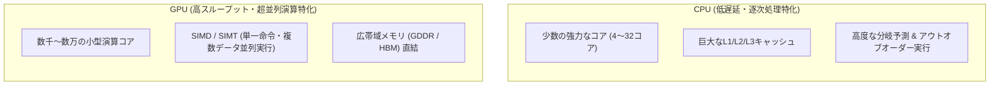
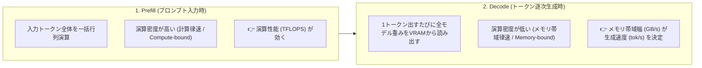
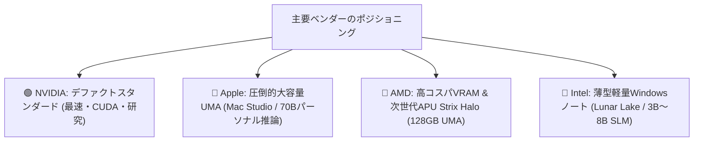
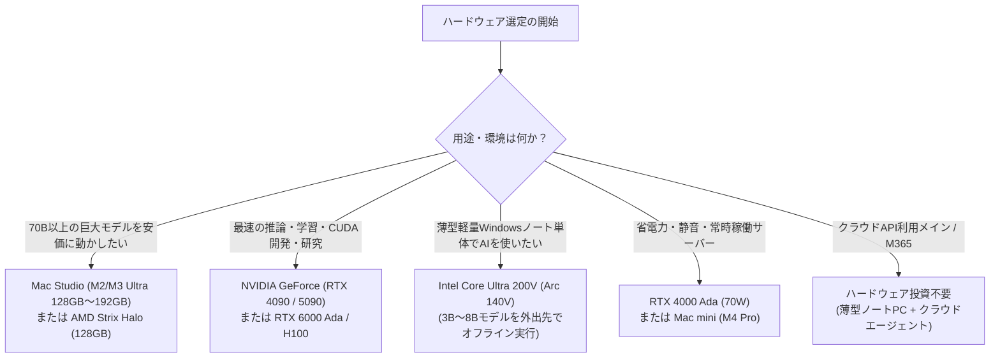

!!! info "対象読者ガイド"
    - 🏢 **M365 Copilot**: ○（ハードウェア基礎知識の把握に加え、**社給PCが最新のIntel Core Ultra搭載機であれば機密データをクラウドに出さない完全オフラインのローカルAI活用も視野**に入ります）
    - 💻 **ローカルLLM**: ◎（GPU/VRAMの選定基準、メモリ帯域の重要性、各社製品の比較と選定判断に直結）
    - ☁️ **高度エージェント**: ○（クラウドGPUインスタンス選定やインフラコスト見積もりの基礎として有用）

---

# 1.0 AIハードウェア入門：GPUの必要性・メモリ帯域・選定マップ

AI技術（特に大規模言語モデル：LLMや生成AI）の急速な進化は、半導体ハードウェアの進化と密接不可分です。本ドキュメントでは、「なぜAIにGPUが必要なのか」「メモリ帯域の重要性」「VRAMサイジングの基準」「各主要ベンダー（NVIDIA、Apple、AMD、Intel）の特徴比較」について、エンジニアの視点から体系的に解説します。

---

## 1. なぜAI（LLM）にGPUが必要なのか？

### 1.1 CPUとGPUの設計思想の違い

汎用プロセッサである **CPU（Central Processing Unit）** と、並列処理に特化した **GPU（Graphics Processing Unit）** は、根本的なアーキテクチャが異なります。

- **CPU**: 複雑な条件分岐、OSの制御、低レイテンシの逐次処理（シングルスレッド性能）を極限まで高める設計。
- **GPU**: 単純な算術演算（加算・乗算）を数千〜数万のコアで一斉に同時実行する **「超並列スループット（Throughput）」** 特化の設計。

AIモデル（ニューラルネットワーク / Transformer）の計算は、その大半が **「行列積演算（GEMM: General Matrix Multiply）」** です。数十億〜数千億個のパラメータ（重み）に対して同時に積和演算を行うため、圧倒的な並列処理能力を持つGPUが不可欠となります。

---

### 1.2 計算速度（FLOPS）とメモリ帯域（Memory Bandwidth）の決定的役割

AI処理の性能特性を理解する上で最も重要なのが、計算機科学やハードウェア工学における **「計算律速（Compute-bound）」** と **「メモリ帯域律速（Memory-bandwidth-bound）」** の概念です。

??? tip "💡 用語解説：『律速（りっそく / Bound）』とは？"
    「**律速（りっそく）**」とは、一連の処理の中で**全体の速度を決定づけている（律している）最大のボトルネック段階**を指す専門用語です（英語の *Rate-determining* や *Bound* の定訳）。
    
    - **計算律速（Compute-bound）**: メモリ転送は間に合っており、**演算器（GPUコア）の計算速度**が限界となって全体の処理速度が決まっている状態。
    - **メモリ帯域律速（Memory-bound）**: 演算器には余力があるが、**メモリからデータを読み出す速度（帯域幅）**が遅くて足かせになっている状態。

| フェーズ | 処理内容 | 律速要因（ボトルネック） | 影響するハードウェア指標 |
| :--- | :--- | :--- | :--- |
| **Prefill（プロンプト処理）** | 入力された長文プロンプトを一括でエンコードする | **計算律速（Compute-bound）** | **TFLOPS / Tensorコア性能** |
| **Decode（逐次トークン生成）** | 次の単語（トークン）を1つずつ順番に出力する | **メモリ帯域律速（Memory-bound）** | **メモリ帯域幅（Memory Bandwidth: GB/s）** |

#### トークン生成速度（Decode）の計算式
LLMがバッチサイズ=1でトークンを1つ生成する際、モデルの重みパラメータ全体をメモリからロードする必要があります。

$$\text{理論最大生成速度 (tokens/s)} = \frac{\text{メモリ帯域幅 (GB/s)}}{\text{モデルサイズ (GB)}}$$

> **例：32Bモデル（Q4量子化 = 約20GB）を動かす場合**
> - **メモリ帯域 136 GB/s（Intel Lunar Lake）**: 最大 $\approx 6.8 \text{ tokens/s}$
> - **メモリ帯域 256 GB/s（AMD Strix Halo）**: 最大 $\approx 12.8 \text{ tokens/s}$
> - **メモリ帯域 800 GB/s（Apple M3 Ultra）**: 最大 $\approx 40 \text{ tokens/s}$
> - **メモリ帯域 1,008 GB/s（NVIDIA RTX 4090）**: 最大 $\approx 50 \text{ tokens/s}$

---

## 2. VRAM容量の重要性とサイジング基準

ローカルでLLMを実行する場合、**「VRAM容量」は動作可能な最大モデルサイズ** を決定します。

| VRAM容量 | 動作可能なオープンモデル目安 (Q4〜Q8量子化) | 主な用途・適合環境 |
| :--- | :--- | :--- |
| **16GB** | 7B〜8B（Q8/FP16）、14B（Q4_K_M） | 個人開発、日常チャット、軽量コード補完 |
| **24GB** ⭐ | 14B〜32B（Q4_K_M）、DeepSeek-R1-Distill-32B（Q4） | **ローカル開発の標準**。本格RAG・思考モデル実行 |
| **32GB〜48GB** | 32B（Q8）、Command-R 35B（Q4）、**70B（Q4: 48GB時）** | 劣化なし32B推論、マルチモーダルVLM、70Bモデル実行 |
| **96GB〜128GB+** | **70B（Q8/FP16）**、120B、大型MoEモデル | クローズドモデルに迫る高度推論、パーソナル推論サーバー |

---

## 3. 主要ベンダー別ハードウェア比較サマリー

AIハードウェアを提供する主要4社の特徴・強み・位置づけは以下の通りです。

| ベンダー / シリーズ | メモリ構造 | 最大VRAM目安 | 主な強み | 主な制約・弱点 | 詳細ガイド |
| :--- | :--- | :--- | :--- | :--- | :--- |
| **🟢 NVIDIA** (GeForce / RTX Ada) | ディスクリート (GDDR6X/GDDR7) | 16GB〜48GB (データセンター80GB+) | **圧倒的なCUDAエコシステム**、最速の推論・学習速度 | VRAM単価が高い、消費電力大 | [👉 1.1 NVIDIA 詳細](1_1_nvidia.md) |
| **🍎 Apple** (M-Series Ultra/Max) | 統合メモリ (UMA) 最大 800 GB/s | **最大 192GB+** | **70B超の巨大モデルを1台で実行可能**、省電力・静音 | ピーク演算性能は低め、CUDA非互換 | [👉 1.2 Apple 詳細](1_2_apple.md) |
| **🔴 AMD** (Radeon / Strix Halo) | GDDR6 / 256-bit UMA ~256〜960 GB/s | 16GB〜24GB (Strix Halo: **128GB**) | **高いVRAMコスパ**、Windows/Linuxでの大容量APU | ROCm環境の構築難易度（Windows等） | [👉 1.3 AMD 詳細](1_3_amd.md) |
| **🔵 Intel** (Core Ultra / Arc Xe2) | オンパッケージ LPDDR5X 約 136 GB/s | 最大 32GB (共有) | **1kg台の薄型ノートで8Bモデルが動く**、OpenVINO | 帯域制限のため14B以上のモデルは低速 | [👉 1.4 Intel 詳細](1_4_intel.md) |

---

## 4. ハードウェア選定フローチャート & ユースケース別推奨

| ユーザー要件 | おすすめハードウェア構成 | 理由・ポイント |
| :--- | :--- | :--- |
| **薄型モバイルノート単体でAI活用** (3B〜8Bモデル) | **Intel Core Ultra 200V (Arc 140V 搭載機)** | 136GB/s帯域とXe2アーキテクチャにより、dGPUなしで8Bが実用速度 |
| **コスパ重視のローカルLLM入門** (8B〜14Bモデル) | **NVIDIA RTX 4070 Ti Super / 4080 (16GB)** | 16GB VRAMにより14B Q4まで実用速度で動作。CUDA互換性完璧 |
| **本格的ローカルLLM / RAG / 思考モデル** (14B〜32Bモデル) | **NVIDIA RTX 4090 (24GB) / RTX 5090 (32GB)** | 24GB〜32GB VRAM + 1TB/s超の帯域。圧倒的レスポンス（50+ tok/s） |
| **大容量70Bモデルの個人研究・推論** (70B〜120Bモデル) | **Apple Mac Studio (M2/M3 Ultra 128GB〜192GB)** または **AMD Strix Halo (128GB)** | GPU単体では高価な大容量VRAMを、UMAにより圧倒的低コストで確保 |
| **エンタープライズ・商用サービス構築** | **NVIDIA H100/H200 / クラウドGPUインスタンス** | 大規模分散推論、高スループット、SLA保証 |

---

## 5. ベンダー別詳細ドキュメント一覧

- 🟢 [**1.1 NVIDIA製GPU・VRAM選定とCUDAエコシステム**](1_1_nvidia.md)
  - GeForce RTX 4080/4090/5080/5090、RTX Adaワークステーション、データセンター向け比較
- 🍎 [**1.2 Apple Silicon (M2/M3/M4 Ultra) と UMA アーキテクチャ解説**](1_2_apple.md)
  - 統合メモリ（UMA）、最大192GB+共有、MLX/Metalによる70Bモデル推論
- 🔴 [**1.3 AMD製GPU・次世代APU「Strix Halo」とROCm**](1_3_amd.md)
  - Radeon RX 7900 XTX 24GBコスパ、Strix Halo 128GB UMA、ROCmの現状
- 🔵 [**1.4 Intel CPU 内蔵GPU（iGPU）のAI性能と活用ガイド**](1_4_intel.md)
  - Core Ultra Lunar Lake Arc 140V Xe2、薄型WindowsノートでのSLM活用、OpenVINO

---

## 6. 関連ドキュメント・シナリオブック

- 📖 [**オープンモデル ベンチマーク（Under 40B）**](../models/benchmark/Benchmark_Open_Weights_Under_40B.md)
- 📖 [**オープンモデル ベンチマーク（40B to 400B）**](../models/benchmark/Benchmark_Open_Weights_40B_to_400B.md)
- 💻 [**ローカルLLM 実践シナリオブック**](../scenarios/persona_local.md)
- 📋 [**AI 関連技術・動向見出し一覧 (Abstract.md)**](../Abstract.md)
