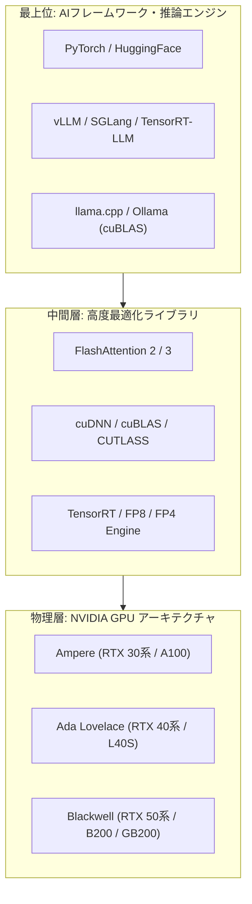
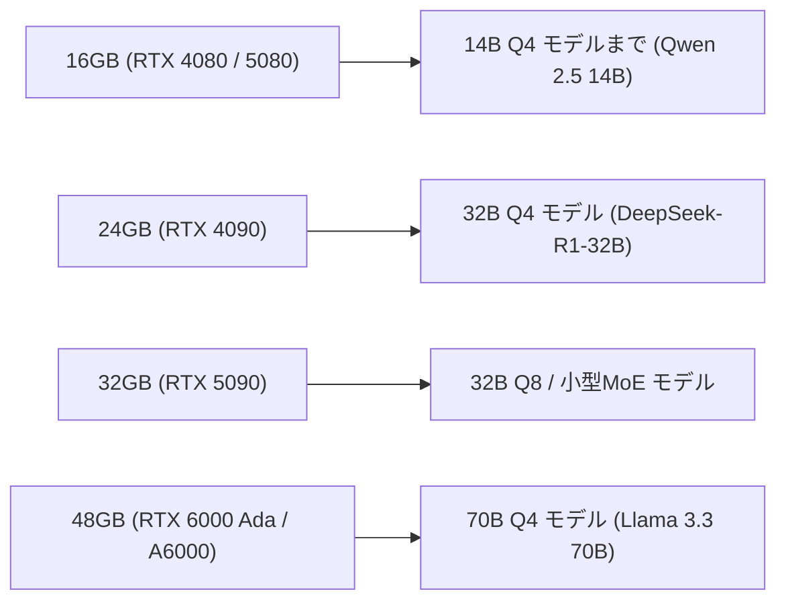

!!! info "対象読者ガイド"
    - 🏢 **M365 Copilot**: △（基礎知識としてNVIDIA製品ラインナップを把握する用途）
    - 💻 **ローカルLLM**: ◎（ローカル推論・ファインチューニング用GPU選定の決定版ガイド）
    - ☁️ **高度エージェント**: ○（クラウドGPUインスタンス（H100/A100等）選定の基礎知識）

---

# 1.1 NVIDIA製GPU・VRAM選定とCUDAエコシステム

NVIDIAは、ディープラーニングおよびLLM（大規模言語モデル）の黎明期からハードウェアとソフトウェアスタックを垂直統合し、AI業界におけるデファクトスタンダードの地位を確立しています。

本ドキュメントでは、ローカル開発・推論・学習で重要となる **VRAM 16GB以上の主要製品比較、世代別アーキテクチャ、価格感、CUDAエコシステムの強み** について詳細に解説します。

---

## 1. NVIDIAがAI市場を独占する理由（CUDAエコシステム）

NVIDIAの強さは、単なる半導体の演算速度だけでなく、2006年から投資を続けてきた **CUDA（Compute Unified Device Architecture）** を中心とする強固なソフトウェアスタックにあります。

### 主なソフトウェア優位性
1. **ファーストクラスのサポート**: 新しいモデルアーキテクチャ（DeepSeek, Llama 3, Qwen 2.5等）や新技術（FlashAttention-3, FP4/FP8量子化）は、**常にNVIDIA CUDA向けに最速で実装・最適化** されます。
2. **TensorRT-LLM による極限の推論最適化**: モデルの重みをFP8/INT4へ自動最適化し、KVキャッシュの効率化やカーネル融合（Kernel Fusion）によって他社製GPUの数倍のスループットを実現。
3. **トラブルの少なさ（プラグアンドプレイ）**: 主要なAIツール（Ollama, vLLM, ComfyUI等）はインストールするだけで自動的にNVIDIA GPUを検出し、最適なバックエンドで動作します。

---

## 2. VRAM 16GB以上の製品ラインナップ & スペック・価格比較

LLMのローカル実行において、**「VRAM容量」はロードできる最大モデル規模** を決め、**「メモリ帯域」はトークン生成速度** を決定します。

### 2.1 主要製品比較テーブル

=== "コンシューマ向け (GeForce RTX)"
    デスクトップPCに搭載可能で、個人開発者・研究者に最も選ばれているシリーズです。

    | モデル名 | アーキテクチャ | VRAM容量 | メモリ帯域 | FP16/FP8 演算性能 | 実売/想定価格帯 | 動作可能なモデル規模 (Q4〜Q8) |
    | :--- | :--- | :--- | :--- | :--- | :--- | :--- |
    | **RTX 4070 Ti Super** | Ada Lovelace | **16GB** GDDR6X | 672 GB/s | 44 TFLOPS | 12〜14万円 | 8B (Q8/FP16), 14B (Q4) |
    | **RTX 4080 (Super)** | Ada Lovelace | **16GB** GDDR6X | 736 GB/s | 52 TFLOPS | 15〜19万円 | 8B (Q8/FP16), 14B (Q4) |
    | **RTX 4090** ⭐ | Ada Lovelace | **24GB** GDDR6X | **1,008 GB/s** | 83 TFLOPS | 30〜38万円 | **14B〜32B (Q4/Q8), DeepSeek-R1-Distill-32B** |
    | **RTX 5080** | Blackwell | **16GB** GDDR7 | 1,024 GB/s | 次世代 | 18〜23万円 | 8B〜14B (超高速推論) |
    | **RTX 5090** ⭐ | Blackwell | **32GB** GDDR7 | **1,792 GB/s** | 次世代 | 35〜45万円 | **32B (Q8), 小型MoE, 70B (超軽量量子化)** |

=== "プロフェッショナル向け (RTX Ada / Aシリーズ)"
    静音性・省電力性・複数枚差し（マルチGPU）適性・ECCメモリによる信頼性を重視したワークステーション向けシリーズです。

    | モデル名 | VRAM容量 | メモリ帯域 | 消費電力 (TDP) | 実売価格帯 | 主な特徴・用途 |
    | :--- | :--- | :--- | :--- | :--- | :--- |
    | **RTX 4000 Ada SFF** | **20GB** GDDR6 (ECC) | 280 GB/s | **70W** (超省電力) | 20〜25万円 | ロープロファイル対応。小型PC・常時稼働推論サーバーに最適 |
    | **RTX 4000 Ada** | **20GB** GDDR6 (ECC) | 360 GB/s | 130W | 22〜26万円 | 1スロット薄型設計。複数枚差しでのスケールアウトが容易 |
    | **RTX 5000 Ada** | **32GB** GDDR6 (ECC) | 576 GB/s | 250W | 60〜75万円 | 32Bモデルを余裕でロード、安定した長時間の学習・推論 |
    | **RTX A6000 (Ampere)** | **48GB** GDDR6 (ECC) | 768 GB/s | 300W | 65〜80万円 (中古40万~) | **48GB大容量**。70B Q4モデルを1枚でロード可能（コスパ高） |
    | **RTX 6000 Ada** | **48GB** GDDR6 (ECC) | **960 GB/s** | 300W | 110〜140万円 | Ada世代最高峰。70Bモデル推論・LoRA学習を高速処理 |

=== "データセンター向け (Hopper / Blackwell)"
    クラウド事業者や大規模企業AIクラスタ向けの最上位アクセラレータです。

    | モデル名 | VRAM容量 | メモリ規格・帯域 | 相互接続 (NVLink) | 主な用途 |
    | :--- | :--- | :--- | :--- | :--- |
    | **H100 SXM5** | 80GB HBM3 | 3,350 GB/s | 900 GB/s (4ポート) | 業界標準のLLM学習・推論インフラ |
    | **H200 SXM5** | **141GB** HBM3e | **4,800 GB/s** | 900 GB/s | HBM3e大容量化により超長文コンテキスト・70B超推論を1枚で高速化 |
    | **B200 / GB200** | 192GB〜 HBM3e | **8,000 GB/s** | 1,800 GB/s | Blackwell世代。第2世代Transformer Engine (FP4) による極限スループット |

---

## 3. VRAM容量別のローカルLLM動作検証

NVIDIA GPUにおけるVRAM容量ごとの「実用的な運用イメージ」は以下の通りです。

- **16GB VRAM（エントリー〜ミドル）**:
  - `Qwen 2.5 7B / 14B (Q4)` や `Llama 3.1 8B (FP16/Q8)` が快適に動作。
  - プロンプトコンテキスト長を32k〜64kに広げるとKVキャッシュでVRAMが圧迫されるため、コンテキスト管理に注意が必要。
- **24GB VRAM（ローカル開発の標準・おすすめ）**:
  - `DeepSeek-R1-Distill-Qwen-32B (Q4)` や `Qwen 2.5 32B (Q4)` が **50+ tokens/s** の超高速で動作。
  - ローカルRAGやコーディングエージェントの推論バックエンドとして最もバランスが良い。
- **32GB〜48GB VRAM（ハイエンド）**:
  - 32Bモデルを劣化の少ないQ8/FP16で動かせるほか、48GBあれば **Llama 3.3 70B (Q4)** を1枚のGPUで完全ローカル実行可能。

---

## 4. 関連ドキュメント

- ⚙️ [**ハードウェア全体概要・基礎理論**](1_0_introduction.md)
- 🍎 [**Apple Silicon (M2/M3/M4 Ultra) と UMA**](1_2_apple.md)
- 🔴 [**AMD Radeon・Strix Halo・ROCm**](1_3_amd.md)
- 💻 [**ローカルLLM 実践シナリオブック**](../scenarios/persona_local.md)
