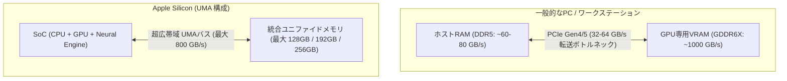
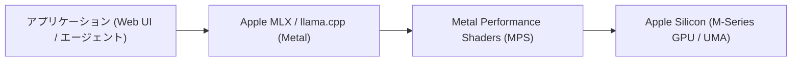

!!! info "対象読者ガイド"
    - 🏢 **M365 Copilot**: △（Mac環境におけるローカルAI機能の仕組みを把握する用途）
    - 💻 **ローカルLLM**: ◎（Mac Studio等を活用した70B超大規模モデルのパーソナル推論環境構築に最適）
    - ☁️ **高度エージェント**: ○（ローカルエージェントの推論バックエンドとしてのMac活用法）

---

# 1.2 Apple Silicon と UMA（統合メモリ）アーキテクチャ

Apple Silicon（Mシリーズ）は、一般的なPC/ワークステーションとは根本的に異なる **UMA（Unified Memory Architecture: 統合メモリアーキテクチャ）** を採用しており、ローカルLLMの世界において独自の強力なポジションを築いています。

本ドキュメントでは、Apple Siliconのメモリ構造、M2/M3/M4チップのスペック比較、70B超の巨大モデルを1台のMacで動かす仕組みとMLXエコシステムについて解説します。

---

## 1. UMA（統合メモリアーキテクチャ）の革新性

一般的なPCでは、CPU用のメインメモリ（DDR5）とGPU専用のVRAM（GDDR6X）が物理的に分離しており、低速なPCIeバスを経由してデータを転送する必要があります。

### Apple Silicon の2大強み
1. **GPUがシステムメモリ全体（最大192GB+）をVRAMとして直接使用可能**:
   - 通常のGPUではVRAM容量（16GB〜24GB）を超えるモデルはロードすらできません。
   - Apple Siliconでは、OSに割り当てるメモリを除いた **全体の75%〜85%（128GBモデルなら約100GB〜110GB）をGPUのVRAMとして直接割り当て可能** です。
2. **超広帯域なメモリアクセス**:
   - SoC（System on Chip）パッケージ上にメモリチップを高密度配置し、最大 **800 GB/s**（Ultraチップ）という、専用GPUに迫る驚異的なメモリ帯域を実現しています。

---

## 2. Apple Silicon チップ別スペック & AI推論性能比較

| チップ名 | メモリ規格・伝送速度 | バス幅 | メモリ帯域幅 | 最大搭載メモリ (UMA) | 割り当て可能VRAM目安 | 動作可能な最大モデル規模 (Q4〜Q8) |
| :--- | :--- | :--- | :--- | :--- | :--- | :--- |
| **M4 / M3 (Base)** | LPDDR5/LPDDR5X (6,400〜8,533 MT/s) | 128-bit | **100〜150 GB/s** | 24GB〜32GB | 約 20GB〜24GB | 8B (Q8), 14B (Q4) |
| **M4 Pro / M3 Pro** | LPDDR5/LPDDR5X (6,400〜8,533 MT/s) | 192〜256-bit | **150〜273 GB/s** | 36GB〜64GB | 約 30GB〜50GB | 14B (Q8), 32B (Q4) |
| **M4 Max / M3 Max** | LPDDR5/LPDDR5X (6,400〜8,533 MT/s) | 384〜512-bit | **300〜546 GB/s** | 64GB〜**128GB** | 約 50GB〜**100GB** | **70B (Q4: Llama 3.3 70B)** |
| **M2 Ultra / M3 Ultra** ⭐ | LPDDR5/LPDDR5X 高密度直結 | 800〜1024-bit | **800 GB/s** | **128GB〜192GB+** | 約 100GB〜**160GB+** | **70B (Q8/FP16), 120B, 大型MoE** |

---

## 3. 実用例：70B〜120Bモデルのローカル推論

Apple Mac Studio（M2/M3 Ultra 128GB/192GB構成）は、**「数百万円のマルチGPUサーバーを用意することなく、1台のデスクトップ機（数十万〜100万円程度）で70B以上のフロンティア級オープンモデルを完全ローカルで動かせる唯一の現実的選択肢」** です。

### トークン生成速度の実測目安（Mac Studio M2/M3 Ultra 192GB）
- **Qwen 2.5 72B (Q4_K_M: 約42GB)**: **約 16〜20 tokens/s**（人間が読む速度を上回り、実用十分）
- **DeepSeek-R1-Distill-Llama-70B (Q4_K_M)**: **約 15〜18 tokens/s**
- **Qwen 2.5 32B (Q8: 約34GB)**: **約 22〜28 tokens/s**

---

## 4. ソフトウェアエコシステム（MLX & Metal）

Appleは自社シリコンの性能を最大限に引き出すため、独自のオープンソース機械学習フレームワーク **`MLX`** を提供しています。

- **MLX (Machine Learning for Apple Silicon)**:
  - NumPy/PyTorchに似た直感的なPython API。
  - UMAを前提に設計されており、メモリコピーのオーバーヘッドなし（Zero-copy）でCPUとGPUを行き来可能。
  - LoRAファインチューニングや、最新モデルの4-bit/8-bit高速推論を公式サポート。
- **llama.cpp / Ollama の Metal 対応**:
  - `llama.cpp` は Apple の **Metal API** にフル対応しており、Mac上でインストールするだけで自動的にGPUアクセラレーションが有効になります。

---

## 5. Apple Silicon の強みと限界まとめ

### メリット（強み）
- **圧倒的なメモリ容量単価**: 128GB〜192GBのVRAM環境を最も省スペース・低消費電力（ピーク時でも100W〜200W程度）・静音で構築可能。
- **個人の研究・推論サーバーに最適**: 70Bクラスのモデルを常時起動してAPIサーバー（Ollama）として家庭内・社内に提供可能。

### デメリット（限界）
- **ピーク計算性能（FLOPS）**: 純粋な演算性能はNVIDIA RTX 4090/5090のTensorコアに及ばないため、大規模な事前学習やフルファインチューニングには不向き。
- **CUDA専用ライブラリとの非互換**: 一部の最新研究コードやCUDA固有の拡張機能は、Metal/MLXへの移植を待つ必要があります。

---

## 6. 関連ドキュメント

- ⚙️ [**ハードウェア全体概要・基礎理論**](1_0_introduction.md)
- 🟢 [**NVIDIA製GPU・VRAM選定とCUDAエコシステム**](1_1_nvidia.md)
- 🔴 [**AMD Radeon・Strix Halo・ROCm**](1_3_amd.md)
- 💻 [**ローカルLLM 実践シナリオブック**](../scenarios/persona_local.md)
