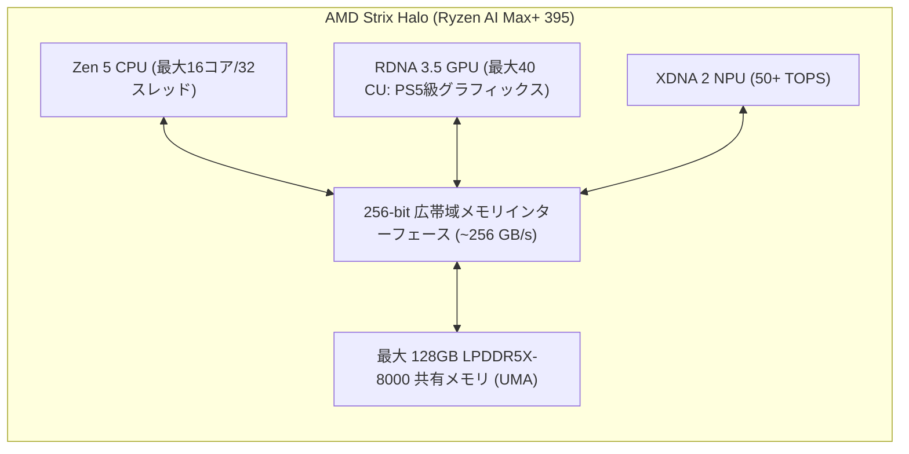
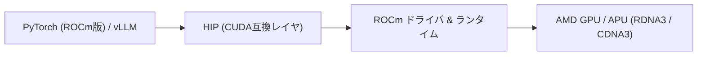

!!! info "対象読者ガイド"
    - 🏢 **M365 Copilot**: △（AMDのAIチップ戦略の全体像を把握する用途）
    - 💻 **ローカルLLM**: ◎（RX 7900 XTXの24GBコスパやStrix Haloでの小型大容量LLM環境構築に直結）
    - ☁️ **高度エージェント**: ○（Microsoft Azure等のInstinct MI300Xインスタンス活用の基礎知識）

---

# 1.3 AMD製GPU・次世代APU「Strix Halo」とROCm

AMDは、高いハードウェアコストパフォーマンス（VRAM単価の安さ）と、Apple Siliconに対抗する大容量統合メモリAPU **「Strix Halo（Ryzen AI Max）」**、さらにデータセンター向けの **「Instinct MI300シリーズ」** により、AIハードウェア市場で独自の存在感を高めています。

本ドキュメントでは、AMDのGPU/APUラインナップ、Strix Haloのアーキテクチャ、およびオープンソフトウェアスタック **ROCm** の現状について解説します。

---

## 1. AMD製GPUの現状とラインナップ

### 1.1 コンシューマ向け（Radeon RX 7000 / 8000 シリーズ）

Radeonシリーズの最大の魅力は、**「大容量VRAMを低価格で入手できるコストパフォーマンス」** です。

| モデル名 | VRAM容量・メモリ規格 | メモリ帯域幅 (ピン伝送速度 / バス幅) | 実売価格帯 | NVIDIA同等VRAM製品との比較 |
| :--- | :--- | :--- | :--- | :--- |
| **Radeon RX 7800 XT** | **16GB** GDDR6 | **624 GB/s** (19.5 Gbps / 256-bit) | 7〜8万円 | RTX 4070 Ti Super（13万円〜）の約半額で16GB VRAMを確保 |
| **Radeon RX 7900 XT** | **20GB** GDDR6 | **800 GB/s** (20 Gbps / 320-bit) | 11〜13万円 | 20GB VRAMで32Bモデル（Q4）が余裕で動作 |
| **Radeon RX 7900 XTX** ⭐ | **24GB** GDDR6 | **960 GB/s** (20 Gbps / 384-bit) | **14〜16万円** | **RTX 4090（30万円超）の半額で24GB VRAMを入手可能** |

---

### 1.2 データセンター向け（Instinct MI300X / MI325X）

データセンター市場において、AMD Instinct MI300Xは **NVIDIA H100に対する最大の対抗馬** として急成長しています。

- **192GB〜256GB HBM3/HBM3e 大容量メモリ**:
  - H100（80GB）に対して2倍以上のVRAMを1チップで搭載。
  - **70Bクラスのモデルを「1枚のGPU」でFP16/FP8で完全ロード可能**（NVIDIAでは2枚〜4枚のH100へのモデル分割が必要な場合がある）。
- **大手クラウドでの採用**:
  - Microsoft AzureやOracle Cloud、各種AIスタートアップがLLM推論サービスに大規模導入を進めています。

---

## 2. 次世代APU「Strix Halo（Ryzen AI Max）」の衝撃

2025年に登場した **「Strix Halo」（Ryzen AI Max 300シリーズ / Ryzen AI Max+ 395）** は、Windows / Linux PCにおけるローカルLLM実行環境のゲームチェンジャーです。

### Strix Halo の主な特徴とメリット
1. **最大128GBの統合メモリ（UMA）**:
   - Apple Siliconと同様に、CPU・GPU・NPUが広大なメモリ空間を共有。
   - **最大96GB〜110GB程度をVRAM（GPU用）として割り当て可能**。
2. **256-bit 広帯域メモリバス（帯域幅 ~256 GB/s）**:
   - 一般的なノートPC（128-bit: ~100GB/s）の2倍以上の帯域を確保。
   - 70B Q4モデルを **約 6〜8 tokens/s**、32B Q4モデルを **約 12〜16 tokens/s** で推論可能。
3. **Apple Siliconに対する価格と自由度の優位性**:
   - Windows 11やLinux（Ubuntu等）がそのままネイティブ動作する小型ミニPCやモバイルワークステーションとして、Mac Studioよりも安価に導入可能。

---

## 3. ROCm（Radeon Open Compute）ソフトウェアスタックの現状

AMDのAI活用における最大の焦点は、オープンソースのソフトウェア基盤 **`ROCm`** の完成度です。

### 現状のメリットと課題
- **HIP（Heterogeneous-compute Interface for Portability）**:
  - NVIDIA CUDAコードを数行の修正または自動変換（hipify）でROCm向けに移植可能。
- **llama.cpp / Ollama での安定性**:
  - Linux環境下での `llama.cpp (HIP BLAS)` は非常に安定しており、RX 7900 XTX や Strix Halo でもセットアップが容易。
- **今後の課題**:
  - Windows環境におけるネイティブROCmサポート（現在DirectMLやVulkanが主流で、Linuxほど完全ではない）。
  - 一部の最新AI研究コード（最新のFlashAttentionブランチなど）で、CUDAに比べて対応が数週間〜数ヶ月遅れる場合がある。

---

## 4. 関連ドキュメント

- ⚙️ [**ハードウェア全体概要・基礎理論**](1_0_introduction.md)
- 🟢 [**NVIDIA製GPU・VRAM選定とCUDAエコシステム**](1_1_nvidia.md)
- 🍎 [**Apple Silicon (M2/M3/M4 Ultra) と UMA**](1_2_apple.md)
- 💻 [**ローカルLLM 実践シナリオブック**](../scenarios/persona_local.md)
