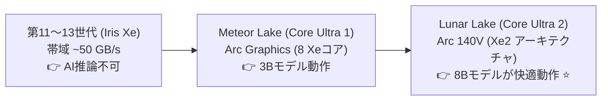
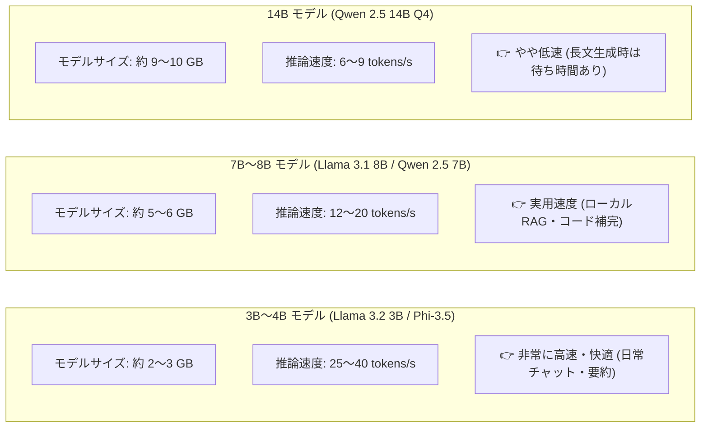
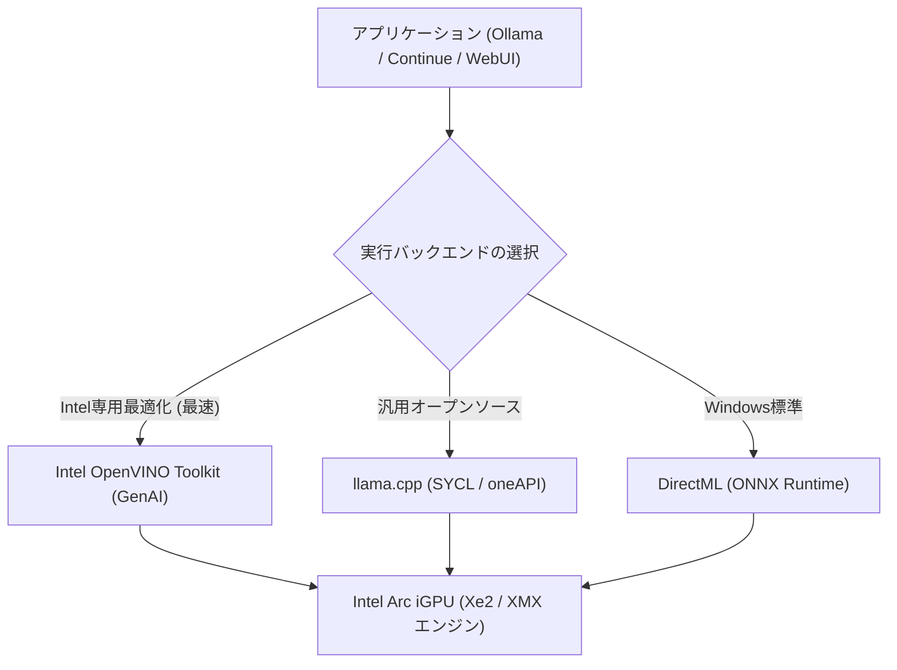

!!! info "対象読者ガイド"
    - 🏢 **M365 Copilot**: ○（**社給の一般的なWindowsノートPCでも最新のCore Ultra搭載機であれば、外部API送信が禁止された機密データ・社内文書を完全オフラインで要約・検索・ローカルAI処理できる可能性**があります）
    - 💻 **ローカルLLM**: ◎（外付けdGPUのない軽量モバイルノート単体で3B〜8Bモデルを快適に動かす手順）
    - ☁️ **高度エージェント**: ○（モバイル環境でのオフライン軽量バックエンド構築）

---

# 1.4 Intel CPU 内蔵GPU（iGPU）のAI性能と活用

従来、CPU内蔵グラフィックス（iGPU）は画面出力や軽量な2D/3D処理が主目的でしたが、**Intel Core Ultra（Meteor Lake / Lunar Lake）世代** からアーキテクチャが一新され、**「外付けGPU（dGPU）を持たない1kg前後の薄型WindowsノートPC単体で、小型LLM（3B〜8Bクラス）が実用速度で動く」** 水準に到達しました。

特にエンタープライズ（M365中心のビジネス環境）においては、**「会社支給の一般的な薄型ビジネスノートPC（ThinkPad, Latitude, Dynabook等）のまま、外部クラウドへの機密データ送信なしで完全ローカルAIを実行できる」** という大きなメリットを持ちます。

---

## 1. 世代別の内蔵GPU性能進化

| 世代・プロセッサ名 | 内蔵GPU名・アーキテクチャ | GPU AI演算性能 | メモリ規格・伝送速度・帯域幅 | AI推論の実用性 |
| :--- | :--- | :--- | :--- | :--- |
| **従来の第11〜13世代** (Core i5/i7/i9) | Intel Iris Xe / UHD | 〜5 TFLOPS (AI拡張なし) | **約 40〜60 GB/s** (DDR4-3200 / DDR5-4800, 128-bit) | ✕ 非推奨（動作しても極めて低速） |
| **Core Ultra Series 1** (Meteor Lake: 100系) | Intel Arc Graphics (Xe-LPG 8コア) | 約 10〜13 TFLOPS | **約 70〜90 GB/s** (LPDDR5-6400 / 7467, 128-bit) | △ 3B〜7Bモデルが最低限動作（~10 tok/s） |
| **Core Ultra Series 2** (Lunar Lake: 200V系) ⭐ | **Intel Arc 140V / 130V** (Xe2 アーキテクチャ) | **最大 67 TOPS (INT8)** 約 15 TFLOPS (FP16) | **約 136 GB/s** (オンパッケージ **LPDDR5X-8533**, 128-bit) | **◎ 3B〜8Bモデルが快適に動作（15〜40 tok/s）** |

---

## 2. 実際のLLM推論速度の目安（Lunar Lake: Arc 140V）

オンパッケージメモリ（LPDDR5X-8533: 帯域幅 約136 GB/s）を搭載する **Lunar Lake（Arc 140V）** で、**OpenVINO** または **llama.cpp（SYCL / Vulkan）** を利用した場合の生成速度の目安です。

- **3B〜4Bモデル（Llama 3.2 3B, Phi-3.5 mini等）**: **25〜40 tokens/s**
  - 人間が読むスピードより圧倒的に速く、即座に返答が返ってきます。
- **7B〜8Bモデル（Llama 3.1 8B, Qwen 2.5 7B等）**: **12〜20 tokens/s**
  - コーディング補助やローカルRAGとして十分に実用的な速度です。

---

## 3. 最適化フレームワークと実行環境（OpenVINO & SYCL）

Intel内蔵GPUで最大の性能を引き出すためには、適切なソフトウェアスタックの選択が重要です。

1. **Intel OpenVINO Toolkit**:
   - Intelが提供する公式の推論エンジン。Intel ArcのXMX（Xe Matrix Extensions）を最大限に活用し、最も高速かつ省電力で動作します。
2. **llama.cpp（SYCLバックエンド）**:
   - Intel oneAPI Base Toolkitをインストールしてビルドすることで、Ollamaやllama.cppでIntel iGPUをネイティブ認識・加速できます。

---

## 4. ソフトウェア開発者・エンタープライズ視点でのまとめ

- **🏢 M365環境（社給PC）での機密データ・オフライン処理**:
  - 企業ガバナンスにより外部クラウドAPIへの送信が厳格に禁止されている場合でも、**Core Ultra搭載の社給PCであれば、LM StudioやOllama + OpenVINOを用いて完全オフラインで社内文書の要約や契約書チェック、ローカルRAG** を実行可能です。
- **💻 dGPU不要の超軽量モバイルワークフロー**:
  - 重たいゲーミングノートやワークステーションを持ち歩くことなく、**1kgクラスの薄型ノートPC（ThinkPad, XPS, Zenbook等）1台で、新幹線や外出先のオフラインでも8Bモデルが実用稼働** します。
- **☁️ 適材適所のサイジング**:
  - デスクトップやクラウドでは24GB〜48GBのVRAMで32B〜70Bモデルを動かし、**手元のモバイル端末ではArc 140Vで3B〜8BのSLMを動かす** というハイブリッドな開発体制が極めて現実的になっています。

---

## 5. 関連ドキュメント

- ⚙️ [**ハードウェア全体概要・基礎理論**](1_0_introduction.md)
- 🟢 [**NVIDIA製GPU・VRAM選定とCUDAエコシステム**](1_1_nvidia.md)
- 🍎 [**Apple Silicon (M2/M3/M4 Ultra) と UMA**](1_2_apple.md)
- 🔴 [**AMD Radeon・Strix Halo・ROCm**](1_3_amd.md)
- 💻 [**ローカルLLM 実践シナリオブック**](../scenarios/persona_local.md)
