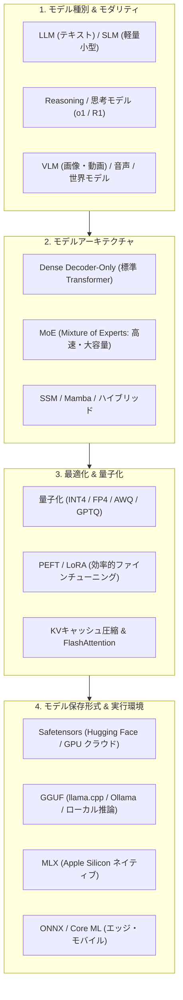
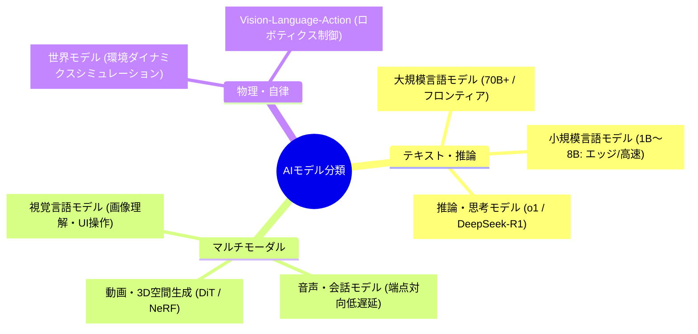
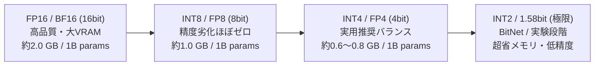
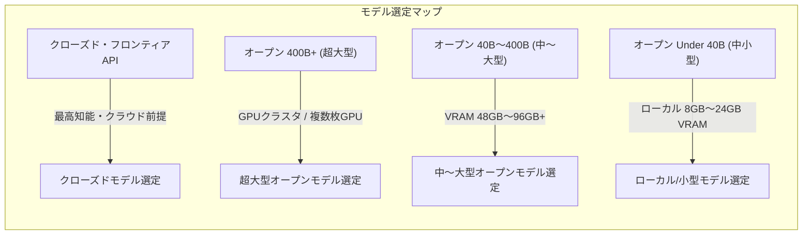

!!! info "対象読者ガイド"
    - 🏢 **M365 Copilot**: ○（背後で動くフロンティアモデルやSLMの仕組み、性能特性の理解に役立ちます）
    - 💻 **ローカルLLM**: ◎（GGUF/MLX等のモデル形式、量子化ビット数選定、VRAM別モデル選定の決定版ガイド）
    - ☁️ **高度エージェント**: ◎（タスクに応じたモデルアーキテクチャ選定、クローズド/オープンモデルのベンチマーク比較に直結）

---

# 2.0 AIモデル・アーキテクチャ・形式：全体概要と選定ガイド

急速に進化するAIエコシステムにおいて、モデルの **「種別（LLM/VLM/世界モデル）」「内部構造（アーキテクチャ）」「保存・配信形式（Safetensors/GGUF/MLX）」「軽量化技術（量子化）」** を正しく理解することは、適切なモデル選定やシステム設計を行うための必須知識です。

本ドキュメントでは、モデルにまつわる要素技術を体系的に整理し、読者の環境（ペルソナ）に最適なモデル選定を支援します。

---

## 1. モデル保存形式 & 実行ランタイム (Model Formats & Runtimes)

モデルの重み（Weights）をファイルに保存し、推論エンジンにロードするための形式は、利用環境やターゲットハードウェアによって最適解が異なります。

| 形式 / ランタイム | 主な用途・ターゲット | 特徴・メリット | 代表的な実行エンジン |
| :--- | :--- | :--- | :--- |
| **Safetensors** | クラウドGPU / 学習 / Hugging Face標準 | ・Pickleの任意コード実行脆弱性を排除した安全なフォーマット ・ゼロコピー（Zero-copy）ロード対応でメモリ転送が高速 | PyTorch, Hugging Face, vLLM, TensorRT-LLM |
| **GGUF** *(旧 GGML)* | ローカルPC / CPU+GPU推論 / エッジ | ・モデル重み、トークナイザ、メタデータを1ファイルに統合 ・メモリマップ（mmap）高速起動 ・VRAM容量に合わせてGPUとCPU(RAM)にレイヤ分割オフロード可能 | llama.cpp, Ollama, LM Studio, Jan |
| **MLX 形式** | Apple Silicon (Mac / iPad) | ・Apple SiliconのUnified Memory Architecture (UMA) ネイティブ ・Metal GPU + CPU間でゼロコピー高速推論・LoRA学習 | Apple MLX, mlx-lm |
| **AWQ / GPTQ / EXL2** | NVIDIA GPU 特化推論 | ・GPUのTensorコアに最適化された4bit/8bit重み形式 ・EXL2（ExLlamaV2）は超高速トークン生成（100+ tok/s）を実現 | vLLM, SGLang, ExLlamaV2, TGI |
| **ONNX / Core ML** | エッジデバイス / Windows / iOS / Web | ・クロスプラットフォーム中間表現（ONNX） ・Apple Neural Engine (ANE) や NPU への最適化コンパイル | ONNX Runtime, Core ML Tools, WebLLM |

??? tip "💡 GGUF形式の重要性（ローカルLLMのデファクトスタンダード）"
    GGUF（GPT-Generated Unified Format）は、Georgi Gerganov氏率いる `llama.cpp` プロジェクトが策定した形式です。
    従来のPyTorch形式ではGPUのVRAMに全モデルを載せる必要がありましたが、GGUFでは「24層中18層をGPUのVRAMに、残り6層をメインメモリ(RAM)のCPUで計算」といった**動的オフロード**が可能なため、民生用PCでも手軽に大型モデルを動作させることができます。

---

## 2. モデル種別とモダリティ (Model Modalities & Types)

AIモデルは入力・出力のモダリティや、内部の推論メカニズムによって以下のように分類されます。

### 2.1 テキスト・推論特化モデル
- **大規模言語モデル (LLM / Large Language Models)**:
  パラメータ数数十B〜数百B級。広範な知識、高度なコード生成、長文文脈把握を行う基幹モデル。
- **小規模言語モデル (SLM / Small Language Models)**:
  1B〜8Bクラス（例: Llama 3.2 3B, Qwen 2.5 7B, Phi-4 mini）。低レイテンシ、ローカル動作、特定タスク特化に向く。
- **推論・思考モデル (Reasoning / Thinking Models)**:
  思考の連鎖（Chain-of-Thought）をモデル内部で自律的に展開し、回答前に「推論時計算量（Test-Time Compute）」を投入して難関数学・競プロ・論理パズルを解く新世代モデル（OpenAI o1/o3-mini, DeepSeek-R1 等）。

### 2.2 マルチモーダル & 物理・世界モデル
- **視覚言語モデル (VLM / Vision-Language Models)**:
  テキストと画像・ドキュメント（PDF/OCR）・スクリーンショットを統合理解（GPT-4o, Claude 3.5 Sonnet, Qwen2.5-VL 等）。
- **音声・リアルタイム対話モデル**:
  音声波形を直接トークンとして処理し、感情・抑揚を保持しながら100〜300msの超低遅延で双方向対話を実現。
- **世界モデル (World Models) & VLA**:
  テキストや映像から物理世界の因果関係や空間ダイナミクスを予測・シミュレーションし、ロボットの行動計画（VLA: Vision-Language-Action）や自律運転に活用。

---

## 3. モデルアーキテクチャ (Model Architectures)

Transformerを基盤としつつ、計算効率・コンテキスト長の限界を突破するための多様な構造が登場しています。

### 3.1 Dense Transformer vs MoE (Mixture of Experts)
- **Dense（密結合モデル）**:
  すべての入力トークンに対して、モデル内の全パラメータを使って計算を行う（例: Llama 3.3 70B）。高い知識密度を持つが計算コストが高い。
- **MoE（スパース疎結合モデル）**:
  モデル全体は巨大（例: 671B）だが、トークンごとにルーターが最適な専門家（Expert）サブネットワーク（例: 37B分）のみを選択して活性化させる（例: DeepSeek-V3, Mixtral 8x7B）。**「高い知能を持ちながら高速な推論スループット」** を実現。

### 3.2 状態空間モデル (SSM / Mamba) & 線形Attention
Transformerの自己注意機構（Attention）が抱える「系列長に対する二次関数的計算量 $\mathcal{O}(N^2)$」の課題を克服するため、線形計算量 $\mathcal{O}(N)$ で無限コンテキストを処理可能なアーキテクチャ（Mamba, Jamba, RWKV）も発展しています。

---

## 4. モデル最適化 & 量子化技術 (Optimization & Quantization)

ハードウェア制約（VRAM容量・帯域）を克服し、モデルを高速・軽量に実行するための主要技術です。

### 4.1 量子化（Quantization）の主要手法
浮動小数点数（FP16 / BF16: 16bit）で表現された重みや活性化関数を、低ビット（8bit, 4bit, 2bit）に丸める技術です。

- **重みのみ量子化 (Weight-Only Quantization)**:
  - **GGUF (k-quants / i-quants)**: `Q4_K_M`, `Q5_K_M`, `IQ4_XS` など。重要レイヤの精度を維持する不等分割量子化。
  - **AWQ (Activation-aware Weight Quantization)**: 活性化値の大きい重要な1%の重みを保護し、4bit化での精度低下を最小化。
  - **EXL2 (ExLlamaV2)**: レイヤごとに異なるビットレート（例: 3.5bit〜6.0bit）を細かく割り振る超高速量子化。
- **重み＋活性化量子化 (W8A8 / W4A4 / FP8)**:
  - **FP8 (NVIDIA Ada/Blackwell, AMD MI300X)**: 行列演算器自体を8bit浮動小数点で実行し、VRAM削減と演算速度2倍を両立。

### 4.2 その他の最適化手法
- **PEFT / LoRA (Low-Rank Adaptation)**: 元のモデル重みを固定し、低ランク行列のみを追加学習することで、数GBのVRAMでファインチューニングを実現。
- **KVキャッシュ圧縮 & PagedAttention**: コンテキスト長増大によるメモリ枯渇を防ぐため、KVキャッシュのページ管理やINT8/FP8量子化を適用。
- **知識蒸留 (Knowledge Distillation)**: 超巨大フロンティアモデルの推論過程や出力を教師データとし、小型モデル（7B/14B等）に高度な推論能力を移植。

---

## 5. 最新モデルクラス別ベンチマーク & 選定マップ

各ユースケースやハードウェア環境に応じたモデル選定の詳細は、以下のクラス別ベンチマークドキュメントに網羅されています。

### 📚 詳細ベンチマークドキュメント一覧

- 📊 **[総合ベンチマーク比較マップ & ポジショニングチャート](benchmark/Benchmark_graph.md)**
  - 全体像: クローズド vs オープンの知能・コスト・ハードウェア要件マトリクス
- 🔒 **[クローズド重みモデル (Closed Weights Benchmark)](benchmark/Benchmark_Closed_Weights.md)**
  - 対象: GPT-4o, Claude 3.7 Sonnet / 3.5 Haiku, Gemini 2.0 Flash / Pro, o1, o3-mini
- 🐘 **[超大型オープンモデル (Open Weights Over 400B)](benchmark/Benchmark_Open_Weights_Over_400B.md)**
  - 対象: DeepSeek-V3 / R1 (671B MoE), Llama 3.1 405B 等
- 🐎 **[中〜大型オープンモデル (Open Weights 40B〜400B)](benchmark/Benchmark_Open_Weights_40B_to_400B.md)**
  - 対象: Qwen 2.5 72B, Llama 3.3 70B, DeepSeek-R1-Distill-Llama-70B, Mixtral 8x22B
- 🚀 **[ローカル・中小型オープンモデル (Open Weights Under 40B)](benchmark/Benchmark_Open_Weights_Under_40B.md)**
  - 対象: DeepSeek-R1-Distill-Qwen (14B/32B), Qwen 2.5 (7B/14B/32B), Gemma 2 (9B/27B), Llama 3.2 (3B), Phi-4 (14B)

---

## 6. 本章の個別詳細ドキュメント一覧

- 🏗️ **[2.1 モデルアーキテクチャ徹底解説](2_1_architecture.md)**: Transformer, Attention進化 (GQA/MLA), MoE, Mamba/SSM
- 📦 **[2.2 モデル保存形式・実行ランタイム](2_2_format.md)**: Safetensors, GGUF, MLX, AWQ/EXL2, ONNX/Core ML
- 👁️ **[2.3 マルチモーダルAI & 世界モデル](2_3_multimodal.md)**: VLM, 音声対話, DiT動画生成, VLA・ロボティクス
- ⚙️ **[2.4 モデル量子化徹底解説](2_4_quantization.md)**: AWQ, GPTQ, GGUF k-quants, FP8, EXL2, KVキャッシュ量子化
- 🧠 **[2.5 推論・思考モデル（Reasoning Models）](2_5_reasoning_models.md)**: Test-Time Compute, GRPO, o1/DeepSeek-R1, 思考蒸留
- 🎯 **[2.6 学習手法・PEFT・アライメント](2_6_training_alignment.md)**: LoRA/QLoRA, DPO, GRPO, 事前学習と合成データ
