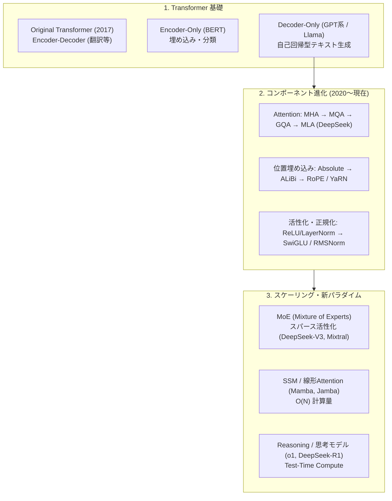
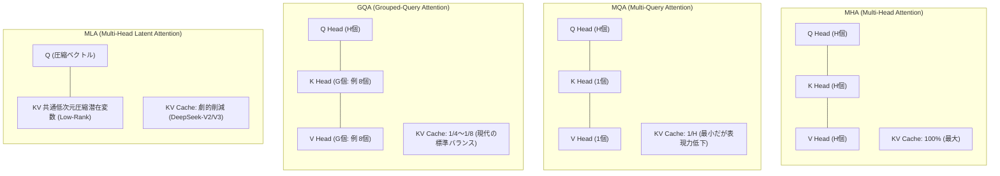
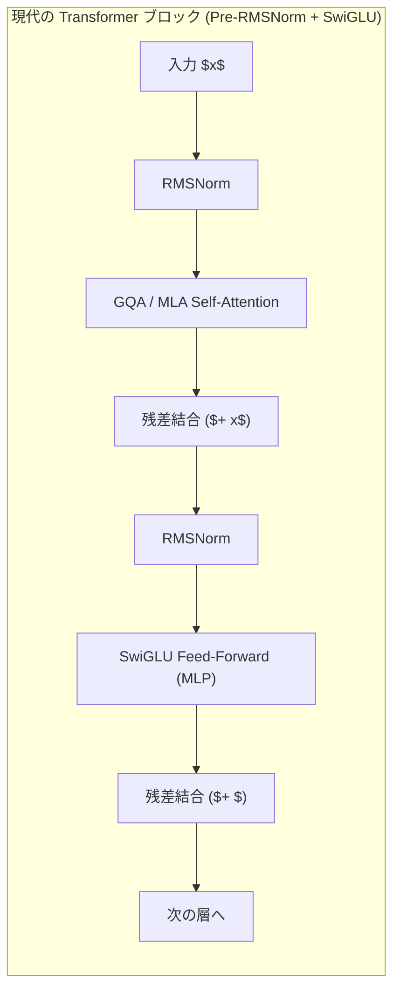
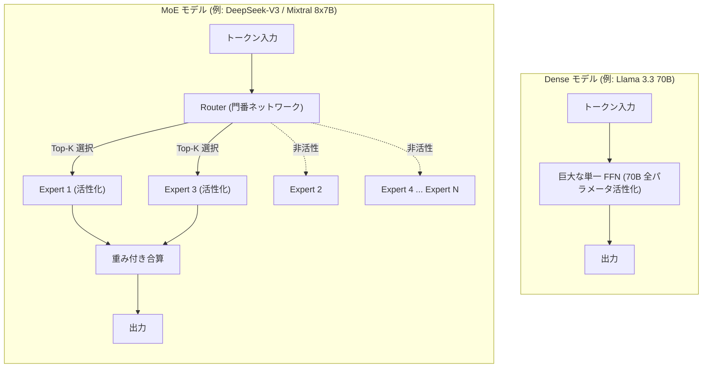

!!! info "対象読者ガイド"
    - 🏢 **M365 Copilot**: ○（背後で動作するモデルの構造的特徴やコンテキスト処理能力の背景理解）
    - 💻 **ローカルLLM**: ◎（MoEとDenseモデルのVRAM消費特性・推論速度の違い、GQAやRoPEによる長文対応の仕組みを把握）
    - ☁️ **高度エージェント**: ◎（長文コンテキスト耐性、推論コスト、マルチモーダル拡張性の評価基準を理解）

---

# 2.1 LLM/AIモデルアーキテクチャ徹底解説

現代の生成AI・LLMは、2017年の **Transformer (Attention Is All You Need)** を基点とし、推論効率の向上、コンテキスト長の拡大、パラメータあたりの知能密度の向上を目指して驚異的な進化を遂げてきました。

本ドキュメントでは、現代のフロンティアモデルおよびオープンウェイトモデルで採用されている主要なアーキテクチャ要素と、その進化の歴史を体系的に解説します。

> **参考・推奨リソース**:
> 詳細なモデル別アーキテクチャ図解・パラメータ構成は、Sebastian Raschka氏の [LLM Architecture Gallery](https://sebastianraschka.com/llm-architecture-gallery/) も併せて参照してください。

---

## 1. 全体像：モデルアーキテクチャの進化系統

---

## 2. Transformer 基本構造と Decoder-Only の標準化

### 2.1 3大アーキテクチャの比較

| アーキテクチャ | 構造特徴 | 主な用途 | 代表例 |
| :--- | :--- | :--- | :--- |
| **Decoder-Only** *(現在の標準)* | 左から右へ逐次的に次のトークンを予測（因果的アテンション / Causal Masking） | テキスト生成、チャット、コード生成、推論タスク全般 | GPT-4, Llama 3, Qwen 2.5, Claude, DeepSeek |
| **Encoder-Decoder** | 入力全体を双方向エンコードし、デコーダが逐次出力 | 機械翻訳、要約、音声認識 (ASR) | T5, Whisper, BART |
| **Encoder-Only** | 入力シーケンス全体を双方向から参照して埋め込みを生成 | テキスト埋め込み (Embedding)、検索、分類 | BERT, RoBERTa, BGE, ColBERT |

なぜ現代のLLMのほぼ全てが **Decoder-Only** を採用しているのか：
1. **スケーリング則（Scaling Laws）との親和性**: 事前学習において「次の単語を予測する（Next Token Prediction）」という極めて単純かつ大量の非構造化データに適した目的関数と完全一致するため。
2. **推論時のKVキャッシュ効率**: 過去のトークンの計算結果をキャッシュ（KV Cache）として再利用し、1トークンずつ高速に生成できるため。

---

## 3. Attention 機構の進化（MHA → MQA → GQA → MLA）

LLMの推論（特にバッチ処理や長文生成）において、**KVキャッシュのメモリ消費**が最大のボトルネックとなります。このKVキャッシュサイズを削減するためにAttention機構が進化しました。

### 3.1 各Attention方式の比較

| 方式 | Q / K / V の比率 | KVキャッシュサイズ | 採用モデル | メリット / デメリット |
| :--- | :--- | :--- | :--- | :--- |
| **MHA** *(Multi-Head Attention)* | $H : H : H$ | **100%** (基準) | GPT-3, Llama 1 | 表現力は最大だが、長文コンテキストでVRAMを大量消費 |
| **MQA** *(Multi-Query Attention)* | $H : 1 : 1$ | **$1/H$** (大幅削減) | PaLM, Falcon, StarCoder | KVキャッシュは極小だが、複雑な文脈把握で精度劣化の懸念 |
| **GQA** *(Grouped-Query Attention)* | $H : G : G$ (通常 $H/G = 4 \sim 8$) | **$1/4 \sim 1/8$** | Llama 2 (70B), Llama 3, Qwen 2.5, Gemma 2, Mistral | **現在のデファクトスタンダード**。MHA同等の精度を維持しつつKVキャッシュを激減 |
| **MLA** *(Multi-Head Latent Attention)* | 低ランク射影圧縮 ($d_c \ll d_h \times H$) | **約 1/5 以下** (さらに極小) | DeepSeek-V2, DeepSeek-V3, DeepSeek-R1 | 鍵・値ベクトルを低次元潜在空間に圧縮。長文推論時のスループットを極限まで向上 |

---

## 4. 内部コンポーネントの現代的標準

現代の高性能LLMで標準採用されているビルディングブロックです。

### 4.1 位置エンコーディング (Position Embeddings)
- **RoPE (Rotary Position Embedding)**:
  単語ベクトルを複素平面上で回転させることで、**相対的な位置関係**を自然にモデル化する手法。現代のほぼすべてのLLM（Llama, Qwen, DeepSeek, Mistral等）で採用。
- **長文拡張（YaRN, NTK-aware RoPE）**:
  RoPEの周波数を適切にスケーリングすることで、8kで学習したモデルを32k〜128kコンテキストへと外挿（Extrapolation）可能にする技術。

### 4.2 正規化と活性化関数
- **RMSNorm (Root Mean Square Normalization)**:
  従来のLayerNormから平均の減算処理を省き、二乗平均平方根のみで正規化。計算量を削減し、FP16/BF16での学習安定性を向上。
- **SwiGLU (Swish Gated Linear Unit)**:
  ReLUやGELUに代わり、ゲート機構を持つ活性化関数を採用。パラメータあたりの表現力と学習収束速度が大幅に向上。

---

## 5. MoE (Mixture of Experts) アーキテクチャ

### 5.1 Dense vs MoE の構造比較

### 5.2 MoE のメリットと運用上の注意点

- **メリット**:
  - **高い知能と超高速推論の両立**: パラメータ総数が数百B（例: 671B）であっても、1トークンあたりの演算量は数十B（例: 37B）で済むため、計算コストとレイテンシを抑えられる。
- **注意点（VRAM要件）**:
  - 推論計算量は37B相当でも、**モデル全体の重み（671B分）はすべてVRAM上に常駐している必要がある**ため、メモリ容量（VRAM）の絶対量は削減できない。

---

## 6. 状態空間モデル (SSM / Mamba) & ハイブリッド構成

### 6.1 Transformer の課題と Mamba のアプローチ

Transformerの自己注意機構は系列長 $N$ に対する計算量とメモリが二次関数 $\mathcal{O}(N^2)$ でスケールするため、100万トークンを超える超長文処理ではコストが跳ね上がります。

- **Mamba (Selective State Space Model)**:
  RNNのように固定サイズの隠れ状態（Hidden State）を維持しながら逐次更新するため、計算量とメモリが系列長に対して **線形 $\mathcal{O}(N)$**、KVキャッシュ容量は **一定 $\mathcal{O}(1)$** となります。
- **ハイブリッドアーキテクチャ (Jamba / RecurrentGemma)**:
  正確な事実想起（Retrieval）に強いTransformer層と、超高速・低メモリなMamba層を交互に重ねるハイブリッド構成も登場しています。

---

## 7. まとめと選定の指針

1. **標準的なタスク・汎用推論**:
   GQA + RoPE + SwiGLU を採用した **Dense Decoder-Only** モデル（Qwen 2.5, Llama 3.3）が最も安定しており、ソフトウェアエコシステムのサポートが万全です。
2. **高スループット・大規模サービス**:
   **MoE モデル**（DeepSeek-V3, Mixtral）を採用することで、同等性能のDenseモデルに比べ大幅に高いトークン生成速度（Throughput）を達成できます。
3. **超長文・低メモリ実行**:
   **MLA（DeepSeek）** や **Mamba / ハイブリッドモデル** がKVキャッシュの消費を劇的に抑え、長文処理のインフラコストを最小化します。
