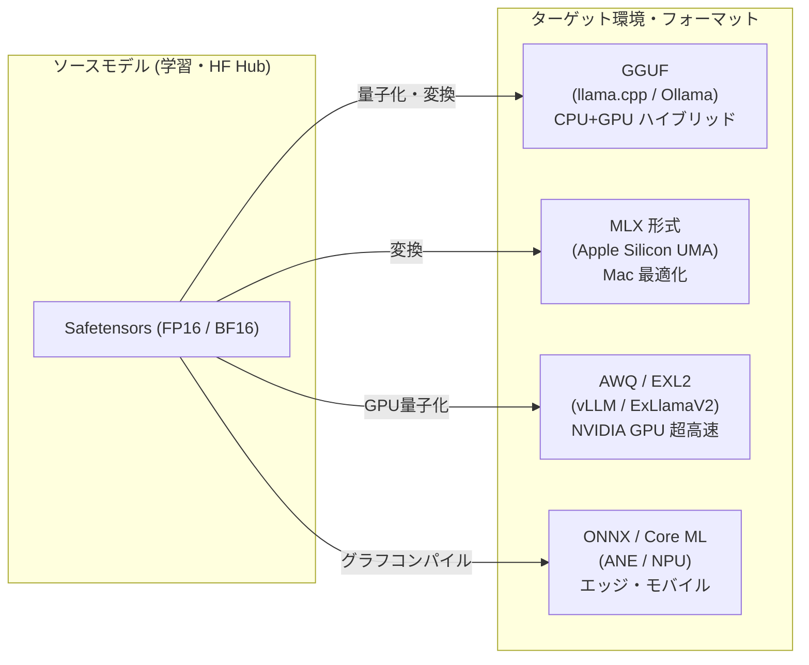
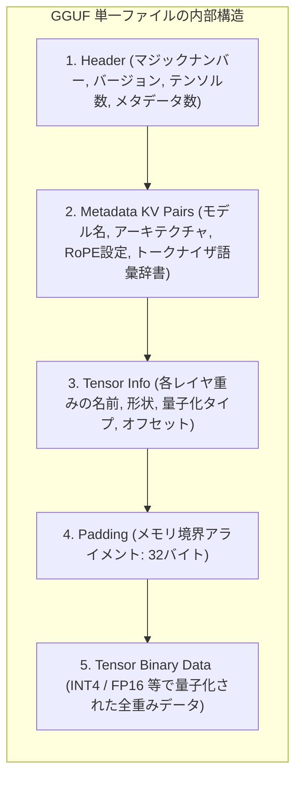

!!! info "対象読者ガイド"
    - 🏢 **M365 Copilot**: △（ローカルファイル形式のため直接の利用はありませんが、基盤技術の理解として参考）
    - 💻 **ローカルLLM**: ◎（**GGUF / MLX / EXL2 の使い分け、mmap高速起動、CPU/GPU動的オフロード**の必須知識）
    - ☁️ **高度エージェント**: ◎（Safetensorsのセキュリティ、vLLM/SGLangでのAWQ/FP8推論サービング最適化）

---

# 2.2 AIモデル保存形式・実行ランタイム完全ガイド

AIモデルの重み（パラメータ）を保存・配信・ロードするためのフォーマットは、過去の汎用シリアライズ形式（Pickle）から、セキュリティ・メモリマップ・ハードウェア特化を考慮した専用形式へと進化しました。

本ドキュメントでは、現代のAIエンジニアリングで頻出する主要モデルフォーマットの特徴、内部構造、および実行ランタイムの使い分けを体系的に解説します。

---

## 1. モデルフォーマット比較一覧



| フォーマット | 開発元 / 主な環境 | セキュリティ / ロード方式 | 特徴 & ベストユースケース |
| :--- | :--- | :--- | :--- |
| **Safetensors** | Hugging Face / クラウドGPU | **最高 (コード実行不可)**<br>Zero-copy mmap | ・Hugging Faceの標準配布形式<br>・GPU学習・フル精度推論、vLLMでのクラウド運用に最適 |
| **GGUF** | llama.cpp コミュニティ / ローカルPC | **最高 (ヘッダー+重みバイナリ)**<br>Direct mmap | ・トークナイザ、メタデータ、重みを1ファイルに内包<br>・GPU VRAMとメインメモリ(CPU)への**動的レイヤ分割オフロード**に対応 |
| **MLX 形式** | Apple Machine Learning Research | **高 (Safetensors/NPZベース)**<br>UMA ネイティブ | ・Apple Siliconのユニファイドメモリ（UMA）に完全最適化<br>・Mac上で最速の推論・LoRAファインチューニングを実現 |
| **AWQ / EXL2** | NVIDIA GPU 特化エコシステム | **高**<br>GPU Tensorコア直結 | ・4bit/8bitでGPU VRAM消費を極小化しつつ高スループット推論<br>・EXL2はExLlamaV2で最速のトークン生成（100+ tok/s）を誇る |
| **ONNX / Core ML** | Microsoft / Apple (エッジ・NPU) | **高**<br>コンパイル済みグラフ | ・Webブラウザ（WebLLM）、Windows Copilot+ PC (NPU)、iOS/iPadOSアプリ組み込み向け |

---

## 2. 各フォーマットの詳細解説

### 2.1 Safetensors（現代の標準・安全な重み形式）

従来のPyTorchモデル（`.pt`, `.bin`）はPythonの `pickle` モジュールを利用していたため、モデルファイルをロードするだけで悪意のあるPythonコードが実行される**深刻なセキュリティリスク（任意コード実行脆弱性）**がありました。

- **Safetensorsの革新性**:
  1. **完全な安全性**: 実行可能コードを含まず、純粋なテンソルデータ（バイト配列）とJSONメタデータのみで構成。
  2. **ゼロコピー（Zero-copy）ロード**: メモリマップ（`mmap`）を用いてディスクからVRAM/RAMに直接データを転送するため、PyTorch形式の最大2倍以上の高速ロードを実現。

---

### 2.2 GGUF (GPT-Generated Unified Format)

`llama.cpp` の作者 Georgi Gerganov 氏らによって設計された、**ローカルLLMのデファクトスタンダード形式**です。



#### GGUF の圧倒的メリット
1. **自己完結性（Self-contained）**:
   モデルの重みだけでなく、Chat Template、トークナイザの語彙（Vocabulary）、RoPE周波数パラメータ等がすべて1ファイルに含まれるため、設定ファイルの欠落によるエラーが起きない。
2. **ハイブリッド実行（CPU + GPU オフロード）**:
   VRAMが足りない場合、モデルのレイヤを一部GPU、残りをCPU(RAM)に割り当てて動作可能（例: `n_gpu_layers=28`）。

---

### 2.3 MLX 形式（Apple Silicon 最適化）

Apple Siliconの **Unified Memory Architecture (UMA)** を最大限に活用するために設計されたフレームワーク「MLX」向けフォーマットです。

- **UMA ネイティブ**:
  CPUとGPUが同一の高速メモリスケール（LPDDR5 / 800GB/s+）を共有するため、メモリ間のデータコピーが一切発生せず、Mac上で極めて高いワットパフォーマンスと推論速度を発揮します。
- **MLX-LM**:
  Hugging FaceのSafetensorsモデルをMac上で直接4bit/8bit量子化して実行可能。

---

## 3. モデルフォーマットの変換ワークフロー

### 3.1 Hugging Face (Safetensors) から GGUF への変換手順

`llama.cpp` のスクリプトを用いて、Safetensors形式からGGUFを作成し量子化する手順です。

```bash
# 1. llama.cpp リポジトリの準備
git clone https://github.com/ggerganov/llama.cpp.git
cd llama.cpp && cmake -B build && cmake --build build --config Release

# 2. Hugging Face モデルを FP16 GGUF に変換
python3 convert_hf_to_gguf.py /path/to/hf_model --outfile model-f16.gguf

# 3. 推奨量子化タイプ (Q4_K_M) に量子化
./build/bin/llama-quantize model-f16.gguf model-Q4_K_M.gguf Q4_K_M
```

---

### 3.2 Hugging Face から MLX 形式への変換（Mac環境）

Apple Silicon Macでは、`mlx-lm` を利用して1行で変換・量子化が可能です。

```bash
# mlx-lm のインストール
pip install mlx-lm

# Hugging Face モデルを 4bit MLX 形式に変換・保存
python -m mlx_lm.convert --hf-path Qwen/Qwen2.5-14B-Instruct -q --q-bits 4 --mlx-path ./mlx-qwen-14b-4bit
```

---

## 4. ペルソナ別・フォーマット選定ガイド

```mermaid
flowchart TD
    START{"実行環境は？"}
    
    START -->|NVIDIA GPU クラウド / サーバー| P_CLOUD["Safetensors / AWQ / FP8<br>(vLLM / SGLang)"]
    START -->|Apple Silicon Mac| P_MAC["MLX または GGUF<br>(mlx-lm / Ollama)"]
    START -->|Windows / Linux PC (RTX or CPU)| P_LOCAL["GGUF または EXL2<br>(Ollama / llama.cpp / ExLlamaV2)"]
    START -->|スマホ / NPU / Webブラウザ| P_EDGE["ONNX / Core ML<br>(WebLLM / ONNX Runtime)"]
```

1. **クラウド・エンタープライズ推論 (`persona-cloud`)**:
   **Safetensors + AWQ / FP8** を `vLLM` や `TensorRT-LLM` でサービングし、スループットと同時リクエスト処理数を最大化します。
2. **ローカルLLM / 制約環境 (`persona-local`)**:
   **GGUF** を選択し、`Ollama` または `llama.cpp` で実行。VRAM容量に応じてGPUレイヤ数を柔軟に調整します。
3. **Mac Studio / MacBook Pro ユーザー**:
   **MLX形式** を選択することで、Apple Siliconのメモリ帯域を100%引き出し、最高速の推論・LoRA学習が可能です。
