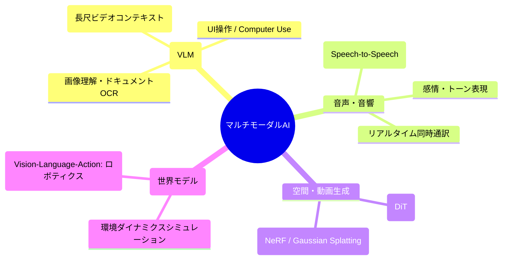
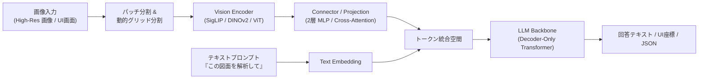
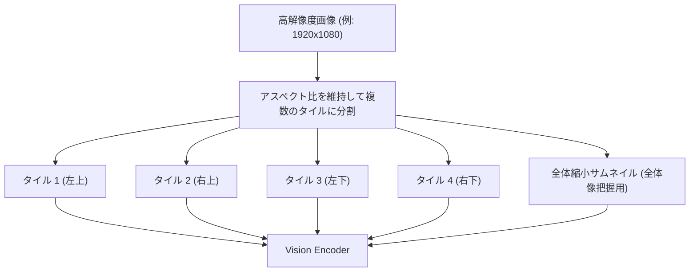
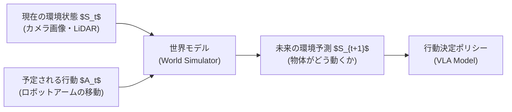

!!! info "対象読者ガイド"
    - 🏢 **M365 Copilot**: ○（Office文書・画像・グラフの自動読み取りや音声議事録機能の技術背景）
    - 💻 **ローカルLLM**: ◎（Qwen2.5-VL / Llama 3.2 Vision 等のローカルVLM実行要件、解像度とVRAM消費の関係）
    - ☁️ **高度エージェント**: ◎（Computer Use / UI自動操作エージェント、ドキュメント解析、マルチモーダルRAG構築の設計基盤）

---

# 2.3 マルチモーダルAI & 世界モデル徹底解説

AIはテキスト単体の処理から、画像・図面・音声・動画、さらには物理空間の因果関係をシミュレーションする **「マルチモーダルAI（Multimodal AI）」** および **「世界モデル（World Models / フィジカルAI）」** へと急速に進化しています。

本ドキュメントでは、VLMの内部構造から最新の世界モデルまでの技術アーキテクチャを体系的に解説します。

---

## 1. マルチモーダルAIの全体像とモダリティ

---

## 2. VLM (Vision-Language Model) の内部アーキテクチャ

現代のVLMは、大きく分けて **「Vision Encoder」「Connector（射影層）」「LLM Backbone（言語モデル）」** の3要素で構成されています。

### 2.1 主要コンポーネントの役割

| コンポーネント | 主な採用モデル | 役割と特徴 |
| :--- | :--- | :--- |
| **Vision Encoder** | SigLIP, CLIP, DINOv2 | 入力画像を $14 \times 14$ や $16 \times 16$ ピクセルのパッチに分割し、視覚特徴量ベクトルに変換 |
| **Connector (射影層)** | 2層 MLP, Q-Former, PixelShuffle | 視覚特徴量の次元をLLMのテキスト埋め込み次元（例: 4096次元）に変換・圧縮し、テキストトークンと同列に扱う |
| **LLM Backbone** | Qwen 2.5, Llama 3, Claude, GPT | テキストトークンと視覚トークンを同一の自己注意機構（Attention）で統合処理し、推論・生成を行う |

---

### 2.2 動的解像度（Dynamic High-Resolution / AnyRes）技術

初期のVLM（$224 \times 224$ や $336 \times 336$ 固定）では、微細な文字（OCR）や図面、高精細なUIボタンを認識できませんでした。

現代の先端VLM（Qwen2.5-VL, Claude 3.5/3.7, GPT-4o）は **「動的解像度分割（AnyRes）」** を採用しています。

- **メリット**: 文字潰れを防ぎ、数千ピクセルの設計図面やソースコードのスクリーンショット、4K動画フレームをそのまま理解可能。
- **注意点（VRAM消費）**: 画像1枚あたり数百〜数千トークンを消費するため、長文コンテキストと同様にKVキャッシュが増加します。

---

## 3. 音声・リアルタイム対話モデル (Real-Time Audio-to-Audio)

従来の「音声認識 (ASR: Whisper) $\rightarrow$ LLM $\rightarrow$ 音声合成 (TTS)」という多段カスケード構成は、遅延（1〜2秒以上）が大きく自然な会話が困難でした。

- **Native Audio-to-Audio (GPT-4o, Gemini Live, Moshi)**:
  音声を直接連続トークンとしてモデルに入力し、音声トークンを直接出力。
  - **超低遅延（100〜300ms）**: 人間同士の会話と同等のレスポンス速度。
  - **非言語情報の保持**: ユーザーの話し方のトーン、感情、ためらい、相槌（Barge-in: 割り込み発話）をリアルタイムに処理。

---

## 4. 動画生成 & 空間生成 (Diffusion Transformer: DiT)

動画生成および3D生成分野では、従来のUNet構造から **Diffusion Transformer (DiT)** への移行が完了しました。

- **Spatiotemporal Patches（時空間パッチ）**:
  動画を「時間（Frame）$\times$ 空間（Height/Width）」の3次元パッチに分解し、Transformerのトークンとして扱う（OpenAI Sora, Wan 2.1, HunyuanVideo 等）。
- **3D Gaussian Splatting (3DGS) & NeRF**:
  複数視点の画像からリアルタイムレンダリング可能な3D空間モデルを高速生成。

---

## 5. 世界モデル (World Models) & VLA（フィジカルAI）

### 5.1 世界モデルとは？
「テキストや動画を生成する」だけでなく、**「物理法則・重力・物体の衝突・人間の行動に対する環境の反応」を内部シミュレーションできるAIモデル**です。

### 5.2 VLA (Vision-Language-Action Models)
ロボットや自動運転車などの物理アクチュエータ（モーター、関節）を直接制御するためのモデルです（Google RT-2, Figure, Tesla FSD v12 等）。
- 入力: カメラ映像 ＋ 「テーブルの上のリンゴをカゴに入れて」という言語指示
- 出力: ロボットアームの6軸座標・グリッパー開閉の連続制御信号（Action Tokens）

---

## 6. マルチモーダルモデルの評価ベンチマーク

| ベンチマーク | 評価対象・タスク | 重要視される能力 |
| :--- | :--- | :--- |
| **MMMU** | 大学レベルの学術マルチモーダル問題（医療、工学、物理等） | 図表理解、専門数式、複雑推論 |
| **MathVista** | 幾何学・グラフ・視覚的数学問題 | 視覚と論理思考の結合 |
| **Video-MME** | 1時間超の長尺動画に対するQ&A | 時間軸の文脈把握、イベント検索 |
| **ScreenSpot / OSWorld** | PC/スマホの画面UI操作（Computer Use） | UI要素の座標特定（Grounding）、Web自動操作 |
