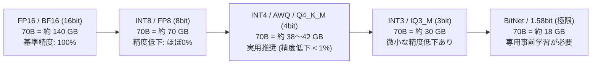
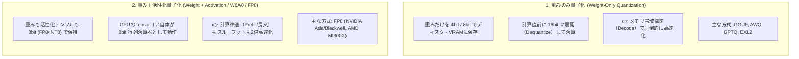
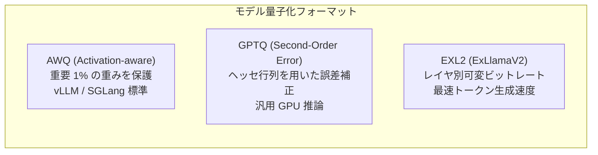

!!! info "対象読者ガイド"
    - 🏢 **M365 Copilot**: △（クライアント側の最適化技術のため直接設定は不要ですが、動作効率化の基礎概念として参考）
    - 💻 **ローカルLLM**: ◎（**Q4_K_MやIQ4_XSの選び方、VRAM上限に応じた最適ビット数の決定、速度・精度のトレードオフ**の完全ガイド）
    - ☁️ **高度エージェント**: ◎（vLLM等でのFP8/AWQサービングによるインフラコスト半減とGPUスループット最大化）

---

# 2.4 AIモデル量子化（Quantization）徹底解説

量子化（Quantization）とは、通常16ビット浮動小数点数（FP16 / BF16）で表現されるモデルの重み（Weights）や活性化値（Activations）を、より少ないビット数（8ビット、4ビット、あるいは2ビット）に圧縮・変換する技術です。

VRAM容量の削減だけでなく、**メモリ帯域幅の消費を削減することでトークン生成速度（Decode）を劇的に向上**させることができます。

---

## 1. 量子化の基本原理と分類

### 1.1 ビット数とVRAM消費量・精度の関係

モデルのパラメータ数 $P$（例: 70B）に対する重みデータのメモリ占有量は以下の式で概算できます。

$$\text{モデル重みサイズ (GB)} \approx P \times \frac{\text{Bits}}{8} \times 1.15 \quad (\text{メタデータ等のオーバーヘッド含む})$$

---

### 1.2 量子化手法の2大アプローチ

---

## 2. GGUF の量子化タイプ一覧と使い分け (`llama.cpp` / `Ollama`)

GGUFでは、単にすべての重みを一律4bitにするのではなく、**「アテンション層など精度に致命的な重要レイヤは高精度に保ち、影響の少ないレイヤを低ビット化する（k-quants / i-quants）」** 手法が採用されています。

| 量子化タイプ | 実効ビット数 | 相対サイズ (vs FP16) | 精度劣化 (Perplexity) | 推奨度・ユースケース |
| :--- | :--- | :--- | :--- | :--- |
| **Q8_0** | 8.50 bpw | 約 55% | ゼロ（ほぼ完全一致） | 精度を一切落としたくない場合・十分なVRAMがある場合 |
| **Q5_K_M** | 5.50 bpw | 約 38% | 極小 | 24GB VRAMで14B〜32Bモデルを動かす際の最高品質選択 |
| **Q4_K_M** | 4.50 bpw | 約 30% | 非常に小さい (< 0.5%) | **最もバランスの良い万人向けデファクトスタンダード** |
| **Q4_K_S** | 4.15 bpw | 約 28% | 小さい | VRAMにギリギリ載らない場合の軽量版 |
| **IQ4_XS** | 4.25 bpw | 約 27% | 非常に小さい | 新世代インポータンス行列量子化（Q4_K_Sより高精度） |
| **IQ3_M** | 3.66 bpw | 約 23% | 軽微（許容範囲） | VRAM 8GBで14Bモデル、VRAM 24GBで70Bモデルを動かす救世主 |
| **IQ2_XXS** | 2.20 bpw | 約 15% | 中程度（用途限定） | 極限環境での検証用 |

??? tip "💡 『k-quants』と『i-quants (Importance Matrix)』の違い"
    - **K-quants (`Q4_K_M` 等)**: モデルのテンソルブロックごとに量子化スケールを変える静的な混合量子化。
    - **I-quants (`IQ4_XS`, `IQ3_M` 等)**: キャリブレーションデータセットを入力した際の重要度（Importance Matrix: imatrix）を計測し、出力への影響が大きい重みを選択的に保護する高度な量子化。

---

## 3. GPU特化量子化フォーマットの比較 (AWQ vs GPTQ vs EXL2)

NVIDIA GPU上で専用推論エンジン（`vLLM`, `SGLang`, `ExLlamaV2`）を用いる場合のフォーマット比較です。

| 項目 | AWQ | GPTQ | EXL2 |
| :--- | :--- | :--- | :--- |
| **量子化アルゴリズム** | 活性化値の大きさに基づく重要重み保護 | 2次微分（Hessian）による量子化誤差最小化 | 誤差測定に基づく可変ビットレート（2.0〜8.0 bpw） |
| **推論速度 (Single GPU)** | 速い | 普通 | **圧倒的最高速 (100〜150+ tok/s)** |
| **マルチバッチ / サーバー対応** | **極めて優秀 (vLLM / SGLang)** | 優秀 | 単一ユーザー・個人向けに特化 |
| **量子化処理時間** | 高速 (数十分) | やや遅い | 高速 |
| **最適ユースケース** | クラウドAPI / 推論サービング | 汎用ローカルGPU推論 | 個人PCでの最速チャット・コード補完 |

---

## 4. KVキャッシュ量子化 (KV-Cache Quantization)

長文コンテキスト（32k〜128kトークン）を処理する際、モデル本体の重みだけでなく **「過去の会話履歴を保持するKVキャッシュ」** が数GB〜十数GBのVRAMを圧迫します。

- **FP16 KVキャッシュ**: 1トークン・1層あたり多くのメモリを消費。
- **FP8 / INT4 KVキャッシュ**:
  `vLLM` や `llama.cpp` では、KVキャッシュを FP8 や Q8_0 / Q4_0 に量子化するオプション（`--kv-cache-dtype fp8` / `-ctk q8_0`）が提供されており、**精度をほぼ損なわずにコンテキスト長を2〜4倍に拡張**できます。

---

## 5. ハードウェア別・量子化選定早見表

| 保有環境 (VRAM / メモリ) | 推奨モデル規模 | 推奨量子化フォーマット & タイプ | 推奨推論エンジン |
| :--- | :--- | :--- | :--- |
| **8GB VRAM** (RTX 3060/4060, Mac 16GB) | **7B〜8B** | `GGUF (Q4_K_M / Q5_K_M)` | Ollama, llama.cpp |
| | **14B** (挑戦) | `GGUF (IQ3_M / IQ3_S)` | llama.cpp |
| **24GB VRAM** (RTX 3090/4090) | **14B〜32B** | `GGUF (Q5_K_M / Q8_0)` または `EXL2 (5.0 bpw)` | ExLlamaV2, Ollama |
| | **70B** (挑戦) | `GGUF (IQ3_M)` または `EXL2 (3.0 bpw)` | llama.cpp, ExLlamaV2 |
| **Apple Silicon (64GB〜128GB)** | **70B** | `MLX (4bit / 8bit)` または `GGUF (Q4_K_M / Q8_0)` | mlx-lm, Ollama |
| | **671B MoE** (DeepSeek-V3/R1) | `MLX (4bit / 3bit)` | mlx-lm |
| **クラウドGPU (A100 / H100 80GB)** | **70B+ / 671B MoE** | `Safetensors (FP8)` または `AWQ (4bit)` | vLLM, TensorRT-LLM, SGLang |
