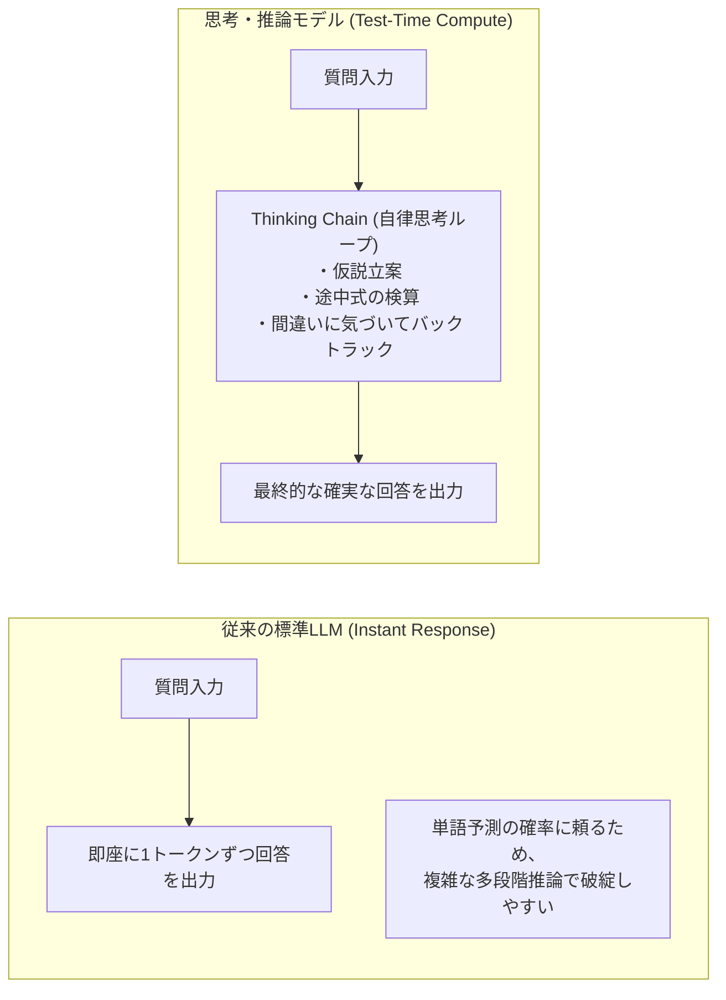
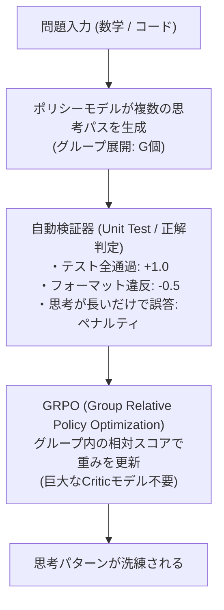

!!! info "対象読者ガイド"
    - 🏢 **M365 Copilot**: ○（複雑な業務分析や論理構成における「考えるAI」の特性と回答待機時間の理由を理解）
    - 💻 **ローカルLLM**: ◎（**DeepSeek-R1-Distill-Qwen (14B/32B) や QwQ-32B をローカルで快適に動かす設定・コンテキスト長設計**）
    - ☁️ **高度エージェント**: ◎（コーディングエージェントや複雑タスクのPlanning層に思考モデルを組み込むアーキテクチャ設計）

---

# 2.5 推論・思考モデル（Reasoning Models）徹底解説

2024年後半から2025年にかけて、AIモデル開発の最前線は「モデルパラメータと学習データ量を増やす（Pre-training Scaling）」から、**「回答を生成する前にモデル自身が時間をかけて深く考える（Test-Time Compute Scaling / 推論時計算量スケーリング）」** へと歴史的なパラダイムシフトを遂げました。

本ドキュメントでは、OpenAI o1/o3-mini や DeepSeek-R1 がなぜ数学・競技プログラミング・複雑な論理パズルで人間レベルの知能を発揮できるのか、その原理と活用法を解説します。

---

## 1. 新たなスケーリング則：推論時計算（Test-Time Compute）



- **事前学習スケーリングの限界**: 高品質な人間作成テキストデータの枯渇と膨大なGPUクラスタ電力コスト。
- **推論時計算量スケーリング**: 難問に対して推論時のトークン生成数（思考トークン数）を増やすほど、モデルの正答率が対数線形に向上する。

---

## 2. 思考モデルの内部メカニズム

思考モデルの出力には、ユーザーへの最終回答の前に **`<think> ... </think>`（思考プロセス）** が含まれます。

```markdown
<think>
1. ユーザーは特定のアルゴリズムのコーナーケースについて質問している。
2. まず愚直なアプローチ（O(N^2)）を検証してみる。
3. ...待てよ、この条件だとN=10^6の時にTLE（実行時間制限超過）になるな。
4. セグメント木またはSparse Tableを使えばO(N log N)に落とせるかもしれない。
5. 境界値（配列が空、要素がすべて同じ）をテストしてみよう。よし、矛盾はない。
</think>
最適な解法はセグメント木を用いた以下のアプローチです...
```

### 思考プロセス内の主要行動
1. **自己検証（Self-Verification）**: 出した中間結果が制約を満たしているか自身で検算。
2. **バックトラッキング（Backtracking）**: 誤った方針に進んだ際に「いや、これは違う」と自ら気づき、別の方針へ戻る。
3. **タスクの細分化（Decomposition）**: 複雑な大問題を小さな部分問題に分割して順次解決。

---

## 3. 強化学習アルゴリズム：RLVR & GRPO

思考モデルの知能を獲得させたコア技術は、人間のフィードバック（RLHF）ではなく、**「正誤判定が厳密に行える強化学習（RLVR: Reinforcement Learning with Verifiable Rewards）」** です。



- **GRPO（DeepSeekが開発）**: 従来のPPO（Proximal Policy Optimization）のように巨大なCritic（価値関数評価）モデルをGPU上に常駐させる必要がなく、グループサンプリングの相対比較で学習できるため、GPUメモリ消費を劇的に削減。

---

## 4. 主要な思考モデル比較

| モデル | 提供形態 | 特徴・強み | ベストユースケース |
| :--- | :--- | :--- | :--- |
| **Gemini 3.7 Flash** | クラウドAPI | ハイブリッド思考（Extended Thinking / 思考トークン予算の動的制御）に対応。超高速・低遅延と最高峰のマルチモーダル推論を両立 | リアルタイム対話・高度自律コーディング・マルチモーダル推論 |
| **OpenAI o1 / o3-mini** | クローズドAPI | 最高峰のSTEM能力、推論労力（Reasoning Effort: Low/Medium/High）の制御が可能 | 難関アルゴリズム実装、論文査読、高度アーキテクチャ設計 |
| **DeepSeek-R1** (671B MoE) | オープンウェイト / API | o1に匹敵する最高峰性能、完全オープンな重みと学習レシピ公開 | クラウドホスティング、社内専用推論基盤 |
| **Qwen 3.8** (27B) | オープンウェイト (GGUF/MLX) | 24GB VRAM環境で最高峰の自律思考・コーディング性能（SWE-bench Pro: 61.7%, LCB v6: 90.3%）を発揮 | **ローカル環境（RTX 3090/4090）での自律エージェント・難関コード開発の決定版** |
| **Ornith 1.5** (9B / 35B MoE) | オープンウェイト (GGUF/MLX) | 自己スキャフォールディング強化学習による自律コーディング・端末操作特化。省VRAM（実効3B〜9B）で高速動作 | ローカル端末自律操作（Terminal-Bench）、高速リファクタリング |
| **DeepSeek-R1-Distill-Qwen** (14B / 32B) | オープンウェイト (GGUF/MLX) | 671B R1の思考データを蒸留した小型モデル。単一GPU（RTX 3090/4090）やMacで実用動作 | ローカル開発環境での難問解決・コード生成 |

---

## 5. 思考モデルの実践プロンプティングと運用注意点

1. **Few-shot プロンプティングを避ける**:
   思考モデルに対して過去の思考例（Few-shot）を与えると、モデル固有の自律的な推論パターンが阻害され、かえって性能が低下することが知られています（Zero-shotが推奨）。
2. **コンテキスト長と出力トークン上限の確保**:
   思考プロセスだけで数千〜数万トークンを消費することがあるため、推論エンジンの `max_tokens`（最大生成トークン数）を 16,384 や 32,768 など十分に大きく設定する必要があります。
3. **エージェントループにおける役割分担**:
   思考モデルは推論に数秒〜数十秒を要するため、高速なリアルタイム応答が必要なUI対話には標準LLM/SLMを用い、**「タスクの計画立案（Planner）」や「コードのデバッグ（Debugger）」に思考モデルを配置する**のがベストプラクティスです。
