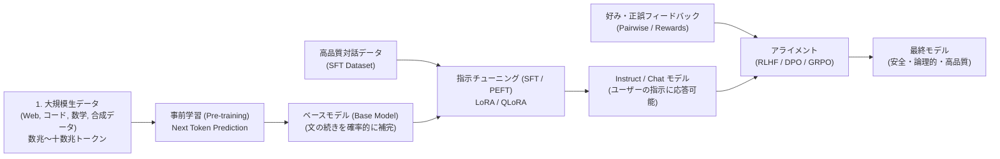
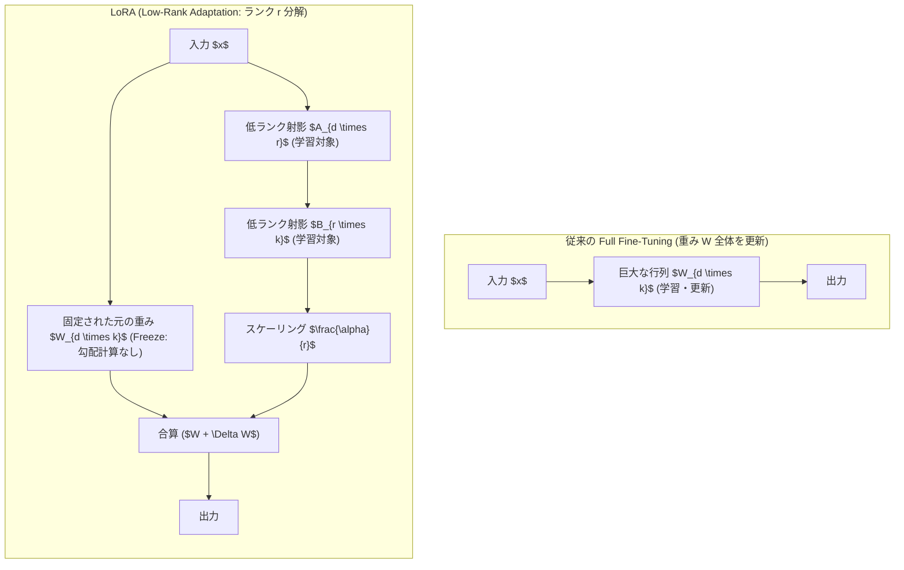
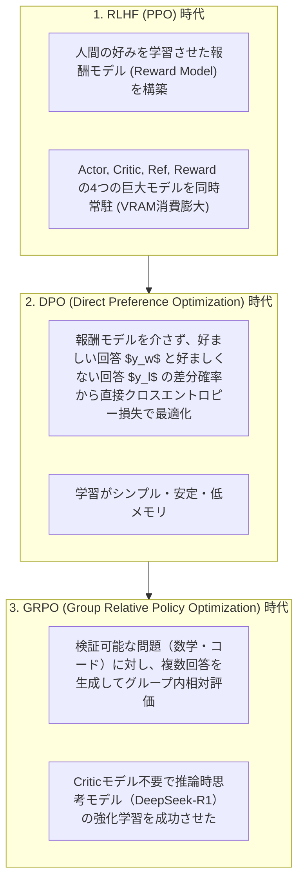

!!! info "対象読者ガイド"
    - 🏢 **M365 Copilot**: △（モデルのトレーニング技術解説のため直接の利用はありませんが、社内特化AIの仕組みとして参考）
    - 💻 **ローカルLLM**: ◎（**Unslothを用いた単一GPU（RTX 3090/4090）でのLoRA/QLoRA高速ファインチューニング手順**）
    - ☁️ **高度エージェント**: ◎（社内ドメイン特化モデルの構築、DPO/GRPOによる自律タスク向けアライメント手法）

---

# 2.6 学習手法・PEFT・アライメント徹底解説

現代の大規模言語モデルは、膨大なテキストデータを読み込む「事前学習」から、指示に従うようにする「指示調整（SFT）」、人間の好みや論理的正しさに合わせる「アライメント」という多段階のパイプラインを経て作成されます。

本ドキュメントでは、モデルの学習ライフサイクルと、エンジニアが実務で活用するPEFT（LoRA）や最新アライメント手法を体系的に解説します。

---

## 1. LLM 学習パイプラインの全体像

---

## 2. PEFT (Parameter-Efficient Fine-Tuning) & LoRA

モデル全体の重みをすべて更新する「フルファインチューニング」は、70Bモデルで数百GB以上のVRAMが必要となり個人や中小企業では困難です。

そこで用いられるのが、モデル重みの大部分を固定（Freeze）し、わずかな追加パラメータのみを学習する **PEFT（代表格: LoRA / QLoRA）** です。

### 2.1 LoRA / QLoRA / DoRA の比較

| 手法 | 特徴 | メモリ要件 (70Bモデル時) | メリット / デメリット |
| :--- | :--- | :--- | :--- |
| **LoRA** | ランク $r$（例: 8〜64）の低ランク行列 $A, B$ のみ学習 | VRAM 48GB〜80GB | 高速・安定。元の重みと完全にマージ可能 |
| **QLoRA** | 元のモデル重みを **4bit NormalFloat (NF4)** に量子化して固定 | **VRAM 24GB〜48GB** | **民生用GPU（RTX 3090/4090 24GB）で大型モデルを学習可能** |
| **DoRA** *(Weight-Decomposed LoRA)* | 重みの「方向（Direction）」と「大きさ（Magnitude）」を分離学習 | LoRAと同等 | フルファインチューニングに極めて近い表現力を達成 |

---

## 3. アライメント手法の進化（RLHF $\rightarrow$ DPO $\rightarrow$ GRPO）

モデルの出力が「指示に正確に従うか」「幻覚（Hallucination）や危険な発言がないか」「論理的に正しいか」を調整する技術です。

---

## 4. 知識蒸留 (Knowledge Distillation)

超巨大フロンティアモデル（教師: Teacher）の推論結果や思考プロセスをデータセット化し、小型モデル（生徒: Student）に学習させる技術です。

- **従来の蒸留**: 教師モデルの出力確率分布（Logits）を小型モデルに真似させる。
- **思考プロセスの蒸留 (Reasoning Distillation)**:
  DeepSeek-R1（671B）が生成した数十万件の `<think> ... </think>` 思考ログを、Qwen 2.5 14Bや32BにSFT学習させることで、**小型モデルでありながら巨大モデルと同等の多段階推論能力を獲得させることに成功**しました。
