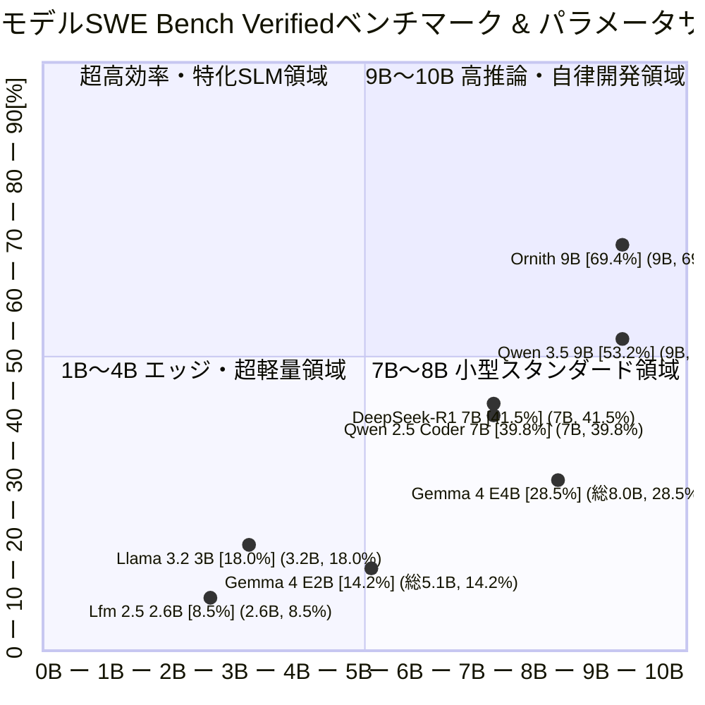

!!! info "対象読者ガイド" - 🏢 **M365 Copilot**: ○（エッジ端末・オンプレミスで動作可能な小型モデルの知能水準の把握）- 💻 **ローカルLLM**: ◎（**8GB以下のVRAMで動作する2025年以降の最新SLMが、実務コーディング・推論でどこまで実用可能か**の定量的確認）- ☁️ **高度エージェント**: ○（低コストなサブエージェント・軽量検証ワーカーとしての小型モデル選定）

---

# 2.A 10B以下AIモデル総合ベンチマーク比較マップ & ポジショニングチャート

本ドキュメントでは、**2025年以降にリリースされた10B以下（パラメータサイズ 10B未満）の小型SLM・エッジ推論・自律コーディング特化モデル** を対象に、**SWE-bench Verified（実務GitHubイシュー解決率）** と **パラメータ規模（1B単位）・必要VRAM** のポジショニングを可視化・比較します。

- **横軸（X軸: パラメータ規模【単位: B】）**: `0B` 〜 `10B` を **1B刻み** で等間隔に配置（1Bあたり 0.10 刻み）
- **縦軸（Y軸: SWE-bench Verified 解決率【単位: %】）**: `0%` 〜 `100%` を **10%刻み** で等間隔に配置（10%あたり 0.10 刻み）
- **プロット点表記**: `モデル名 [実測スコア] (パラメータ規模, 実測スコア)`（例: `Ornith 9B [69.4%] (9B, 69.4%)` は X=0.90, Y=0.69 に位置）

---

## 10B以下モデル・詳細スペック & 特性比較表

| モデル名称                    | パラメータ規模 (総数 / 実効) | リリース時期    | 必要VRAM目安 (Q4〜Q8) | SWE-bench Verified | アーキテクチャ / 得意領域・選定ポイント                                                                                     |
| :---------------------------- | :--------------------------- | :-------------- | :-------------------- | :----------------: | :-------------------------------------------------------------------------------------------------------------------------- |
| 🦅 **Ornith 9B**              | **9B Dense**                 | **2026年6月**   | **6GB 〜 8GB**        |     **69.4%**      | **自己スキャフォールディング強化学習**。10B以下ながらフロンティアモデル（Claude 3.5 Sonnet等）に迫る自律コーディング特化SLM |
| 🐎 **Qwen 3.5 9B**            | **9B Dense**                 | **2026年2月**   | **6GB 〜 8GB**        |     **53.2%**      | Alibaba最新小型モデル。優れた汎用指示追従能力とコード生成・自動リファクタリング                                             |
| 💎 **Gemma 4 E4B**            | **総 8.0B** (Effective 4.5B) | **2026年4月**   | **5GB 〜 6GB**        |     **28.5%**      | Google製軽量マルチモーダル。PLE採用による総8.0B構成（推論時実効4.5B）。CPU・省メモリ補助タスクに最適                        |
| 🚀 **DeepSeek-R1-Distill-7B** | 7B Dense                     | 2025年1月       | 5GB 〜 7GB            |     **41.5%**      | 思考プロセス（CoT）蒸留モデル。数学・論理推論と小規模スクリプト開発                                                         |
| 💻 **Qwen 2.5 Coder 7B**      | 7B Dense                     | 2024年末/2025年 | 5GB 〜 7GB            |     **39.8%**      | ローカルIDE補完（Continue等）の標準的ベースライン                                                                           |
| 💎 **Gemma 4 E2B**            | **総 5.1B** (Effective 2.3B) | **2026年4月**   | **3GB 〜 4GB**        |     **14.2%**      | モバイル・エッジ向け超軽量。総5.1B構成（推論時実効2.3B）。高速推論とネイティブ音声/画像処理                                 |
| 🦙 **Llama 3.2 3B**           | 3.2B Dense                   | 2024年末/2025年 | 2GB 〜 3GB            |     **18.0%**      | Meta製エントリーSLM。要約・軽量チャット向け                                                                                 |
| 💧 **Lfm 2.5 2.6B**           | **2.6B (LFM)**               | **2026年1月**   | **約 2GB**            |      **8.5%**      | Liquid AI製ハイブリッドモデル。超長文RAG・エッジ超低遅延向け（※開発元よりエージェントコーディング用途は非推奨）             |

??? tip "10B以下モデル選定のポイント" - **自律エージェント・実務コーディング重視**: `Ornith 9B / Ornith 1.5` または `Qwen 3.5 9B` が圧倒的なスコアを記録しており、8GB〜16GB VRAMのコンシューマPC・Macで本格的な自律リファクタリングが可能です。自己スキャフォールディング強化学習により、小型ながら端末操作やテスト修正を自律完結できます。- **エッジ・マルチモーダル・省リソース**: `Gemma 4 E4B/E2B` は総パラメータ数に対して推論時の計算効率が高く、音声・画像入力を含む軽量アシスタントに最適です。- **長文要約・RAG特化**: `Lfm 2.5 2.6B` は長文コンテキスト処理に優れますが、複数ファイルにまたがるコード修正タスクには適していません。

---

## 各クラス別詳細ドキュメントへのリンク

より大規模なモデル群のベンチマーク・VRAMサイジング・料金比較は以下を参照してください。

- 🚀 **[ローカル・中小型オープンモデル (Open Weights Under 40B)](benchmark/Benchmark_Open_Weights_Under_40B.md)**
- 🐎 **[中〜大型オープンモデル (Open Weights 40B〜400B)](benchmark/Benchmark_Open_Weights_40B_to_400B.md)**
- 🐘 **[超大型オープンモデル (Open Weights Over 400B)](benchmark/Benchmark_Open_Weights_Over_400B.md)**
- 🔒 **[クローズド重みモデル (Closed Weights Benchmark)](benchmark/Benchmark_Closed_Weights_Flash.md)**
