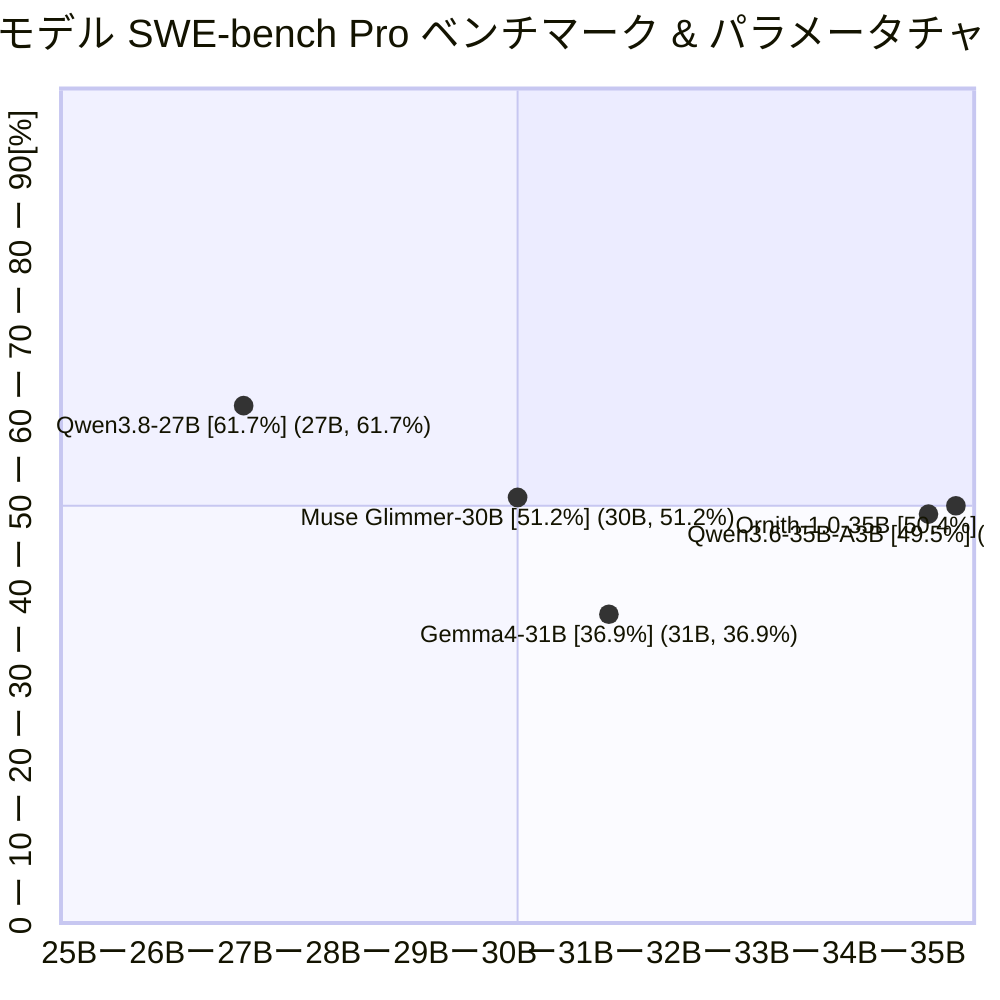
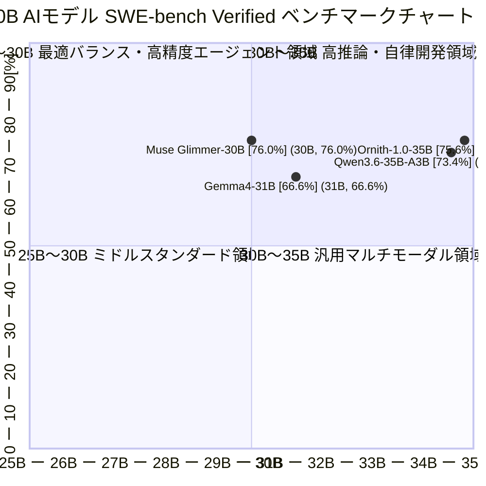

!!! info "対象読者ガイド" - 🏢 **M365 Copilot**: △（ローカル推論環境が必要ですが、オンプレ・セキュア環境での自律エージェント知能指標として参考になります）- 💻 **ローカルLLM**: ◎（**24GB VRAM環境（RTX 3090/4090やMac）で動作する27B〜35B級モデルが、実務コーディング・推論でどこまで実用可能か**の定量的確認）- ☁️ **高度エージェント**: ○（フロンティアモデルに迫るコーディング・推論性能をオープンウェイトで実現するローカル代替候補の選定）

---

# 2.B 10B〜40B AIモデル総合ベンチマーク比較マップ & ポジショニングチャート

本ドキュメントでは、**10B〜40B（パラメータサイズ 10B以上40B以下）の中型オープンウェイトモデル・自律コーディング/推論特化モデル** を対象に、**SWE-bench Pro / SWE-bench Verified（実務GitHubイシュー解決率）** と **パラメータ規模・必要VRAM** のポジショニングを可視化・比較します。

このクラスは、コンシューマハイエンドGPU（RTX 3090 / RTX 4090 24GB）や Apple Silicon（32GB〜64GB Unified Memory）で量子化（Q4_K_M〜Q8_0）実行が可能であり、**ローカル環境で商用フロンティアモデル（Claude 3.5 Sonnet等）に迫る自律コーディング性能を達成する実用スイートスポット**です。

---

## 1. SWE-bench Pro ポジショニングマップ（全モデル共通評価）

全モデルで実測データが揃っている高難度ベンチマーク **SWE-bench Pro (public)** を基準としたポジショニングチャートです。

- **横軸（X軸: パラメータ規模【単位: B】）**: `25B` 〜 `35B`（25B=0.00, 35B=1.00、**1Bあたり 0.10 刻み**）
- **縦軸（Y軸: SWE-bench Pro 解決率【単位: %】）**: `0%` 〜 `100%`（10%あたり 0.10 刻み）
- **プロット点表記**: `モデル名 [実測スコア] (パラメータ規模, 実測スコア)`

---

## 2. SWE-bench Verified ポジショニングマップ（実務イシュー解決率）

業界標準の実務イシュー解決ベンチマーク **SWE-bench Verified** によるポジショニングチャートです。

- **横軸（X軸: パラメータ規模【単位: B】）**: `25B` 〜 `35B`（25B=0.00, 35B=1.00、**1Bあたり 0.10 刻み**）
- **縦軸（Y軸: SWE-bench Verified 解決率【単位: %】）**: `0%` 〜 `100%`（10%あたり 0.10 刻み）

_(※ Qwen3.8-27B は SWE-bench Pro で 61.7% を記録し本クラス首位ですが、SWE-bench Verified スコアは未公表のため上記Verified個別チャートからは除外しています。)_

---

## 10B〜40B モデル・詳細スペック & 特性比較表

| モデル名称              | パラメータ規模 (総数 / 実効) | 必要VRAM目安 (Q4〜Q8) | SWE-bench Pro (public) | SWE-bench Verified | 主要ベンチマークスコア                                                                          | アーキテクチャ / 得意領域・選定ポイント                                                                                                               |
| :---------------------- | :--------------------------- | :-------------------- | :--------------------: | :----------------: | :---------------------------------------------------------------------------------------------- | :---------------------------------------------------------------------------------------------------------------------------------------------------- |
| 🚀 **Qwen3.8-27B**      | **27B Dense**                | **16GB 〜 24GB**      |    **61.7%** (首位)    |         –          | ・LCB v6: **90.3%** ・GPQA: **89.2%** ・Term-Bench 2.1: **73.0%** ・OSWorld: **84.3%** | **本クラス最強の自律思考・コーディングモデル**。SWE-bench Proで61.7%を叩き出し、フロンティア級の推論・端末操作能力を発揮。                            |
| ✨ **Muse Glimmer-30B** | **30B Dense**                | **18GB 〜 26GB**      |       **51.2%**        |  **76.0%** (首位)  | ・MCP Atlas: **75.5%** ・GPQA: 83.5% ・DeepSearch: **74.6%** ・SciCode: **43.6%**      | **MCP (Model Context Protocol) ツール連携特化**。外部ツール呼出（75.5%）や科学技術計算・ディープリサーチに優れたエージェントモデル。                  |
| 🦅 **Ornith-1.0-35B**   | **総 35B / 活性化 3B (MoE)** | **20GB 〜 24GB**      |       **50.4%**        |     **75.6%**      | ・Term-Bench 2.1: **64.2%** ・Claw-Eval Avg: **69.8%** ・SWE Multilingual: **69.3%**      | **自己スキャフォールディング強化学習による自律コーディング特化MoE**。活性化3Bによる超高速推論と、端末自律操作（64.2%）・イシュー解決（75.6%）を両立。 |
| ⚡ **Qwen3.6-35B-A3B**  | **総 35B / 活性化 3B (MoE)** | **20GB 〜 24GB**      |       **49.5%**        |     **73.4%**      | ・LCB v6: 80.4% ・GPQA: 86.0% ・QwenWebBench: 1397                                        | **MoE（総35B/推論時実効3B）アーキテクチャ**。VRAMは20GB台を要するものの、3B並の圧倒的な高速推論と高いコーディング精度を両立。                         |
| 💎 **Gemma4-31B**       | **31B Dense**                | **18GB 〜 28GB**      |       **36.9%**        |     **66.6%**      | ・GPQA: 85.7% ・LCB v6: 80.0% ・OmniDoc: 72.5% ・ScreenSpot Pro: **75.9%**             | Google製中型マルチモーダルモデル。UI画面認識（ScreenSpot 75.9%）・文書解析と高い安全性・プライバシー防御が特徴。                                      |

??? tip "10B〜40B モデル選定と実務運用のポイント" - **最高峰の思考・自律コーディング**: `Qwen3.8-27B` が圧倒的です。24GB VRAM（RTX 3090/4090）に Q4_K_M または Q5_K_M でフルオフロードでき、商用APIに匹敵するローカル自律コーディングループ（Cline / Continue / Claude Code互換）を実現できます。- **自律端末操作・高速コーディングMoE**: `Ornith-1.0-35B` は自己スキャフォールディング強化学習により、Terminal-Bench 2.1（64.2%）や実務SWE-bench Verified（75.6%）で優れた性能を発揮し、推論時実効3Bの軽快な速度で動作します。- **MCP（Model Context Protocol）連携・リサーチ重視**: `Muse Glimmer-30B` は MCP Atlas 75.5% を誇り、ローカル環境で多数のMCPツールを繋いだ自律エージェント運用に最適です。- **高スループット・高速トークン生成**: `Qwen3.6-35B-A3B` はMoE構成により、リアルタイム補完や高速なエージェントステップ実行に適しています。

---

## 各クラス別詳細ドキュメントへのリンク

他クラスのベンチマーク比較および包括的データは以下を参照してください。

- 🐣 **[10B以下小型オープンモデル ポジショニングマップ (Under 10B)](2_A_Benchmark_graph_Unser10B.md)**
- 🚀 **[ローカル・中小型オープンモデル一覧 (Open Weights Under 40B)](Benchmark_Open_Weights_Under_40B.md)**
- 🐎 **[中〜大型オープンモデル (Open Weights 40B〜400B)](Benchmark_Open_Weights_40B_to_400B.md)**
- 🐘 **[超大型オープンモデル (Open Weights Over 400B)](Benchmark_Open_Weights_Over_400B.md)**
- 🔒 **[クローズド重みモデル (Closed Weights Benchmark)](Benchmark_Closed_Weights.md)**
