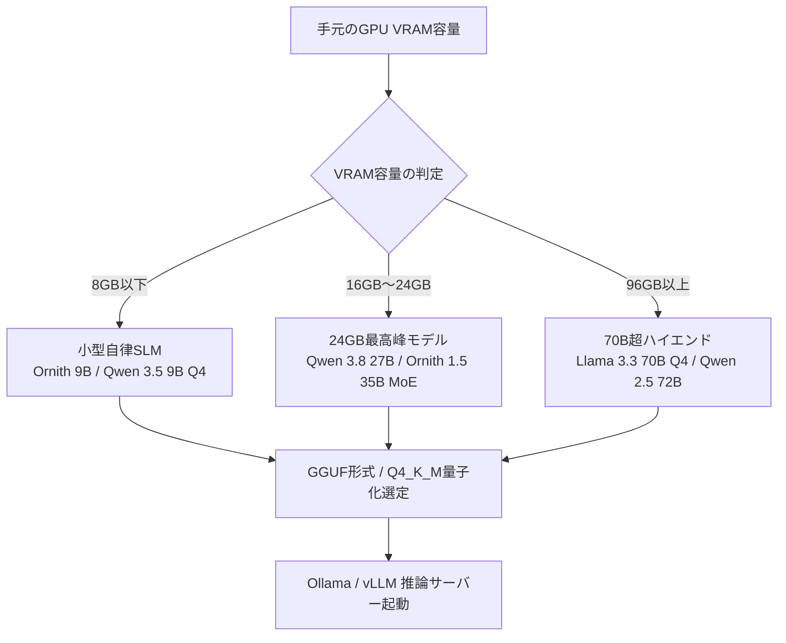

!!! info "対象読者ガイド: ローカルLLM環境"
    - 🏢 **M365 Copilot**: ✕（Office環境限定の方は [M365 Copilot シナリオブック](persona_m365.md) をご参照ください）
    - 💻 **ローカルLLM**: ◎（VRAM別サイジングから推論サーバー・IDE連携・ローカルRAGまで完全網羅）
    - ☁️ **高度クラウドエージェント**: ○（ローカル検証環境やオフラインフォールバックとして参考になります）

---

# ローカルLLM 実践導入シナリオブック

## 1. 本シナリオの前提・ターゲット環境

本シナリオは、社内機密コードの保護、エアギャップ（完全オフライン）環境、またはAPI従量課金を気にせずローカルマシン上で高速にLLMを活用したい開発者を対象としています。

### 想定環境と主な制約
- **対象環境**: NVIDIA RTX GPU搭載PC / ワークステーション、Apple Silicon Mac (Unified Memory)、Ollama / llama.cpp / vLLM、VS Code / Continue
- **主な制約**:
  - 搭載VRAM容量（8GB / 24GB / 96GB+）によるモデルパラメータ数・コンテキスト長の物理的上限
  - クローズドフロンティアモデル（Claude 3.7 / GPT-4o等）との知能・コンテキスト長のトレードオフ
- **目指すゴール**:
  - 手元のVRAM容量に最適なモデルと量子化形式（GGUF / Q4_K_M 等）を選定
  - ローカル推論サーバーを立ち上げ、VS Codeでのタブ補完・チャット・ローカルRAGを構築する

---

## 2. ハードウェア選定 & VRAM別サイジング基準

ローカルLLMの動作安定性と推論速度は、VRAM容量とメモリ帯域幅に完全に依存します。ハードウェア構成の詳細については [ハードウェア導入ガイド](../1_hardware/1_0_introduction.md)、[NVIDIA CUDA環境](../1_hardware/1_1_nvidia.md)、[Apple Silicon環境](../1_hardware/1_2_apple.md) もあわせてご参照ください。

=== "8GB VRAM (エントリー / 一般PC・Mac)"
    - **代表的なハードウェア**: NVIDIA RTX 3060 (8GB) / RTX 4060, Apple Silicon (16GB RAM)
    - **推奨モデル規模**: 3B〜9Bクラス（Q4_K_M 量子化）
    - **推奨モデル例**:
      - 自律コーディング特化SLM: `Ornith 9B / Ornith 1.5 (9B)`（SWE-bench Verified 69.4%）
      - チャット・汎用補完: `Qwen 3.5 9B` / `Qwen2.5-Coder-7B-Instruct (Q4_K_M)` / `Llama-3.2-3B-Instruct`
    - **性能感・用途**: 単一関数の補完、軽量なコード説明、ワンショットでのバグ修正・自動リファクタリング。コンテキスト長は 4k〜16k 推奨。

=== "24GB VRAM (ハイエンド / RTX 3090/4090, Apple Silicon 32GB~)"
    - **代表的なハードウェア**: NVIDIA RTX 3090 / 4090 (24GB VRAM), Apple M2/M3/M4 Pro/Max (32GB〜64GB RAM)
    - **推奨モデル規模**: 14B〜35Bクラス（Q4_K_M / Q8_0 量子化）、自律コーディングMoE
    - **推奨モデル例**:
      - 思考・自律コーディング最高峰: `Qwen 3.8 (27B)` (SWE-bench Pro 61.7%, LCB v6 90.3%)
      - 高速自律コーディングMoE: `Ornith 1.5 (35B MoE / 活性化3B)` (SWE-bench Verified 75.6%)
      - 思考・推論モデル: `DeepSeek-R1-Distill-Qwen-32B` / `DeepSeek-R1-Distill-Qwen-14B`
    - **性能感・用途**: 本格的なリファクタリング、複数ファイルにまたがる自律開発ループ（Cline/Continue）、ローカルRAG、思考トークンを用いた難関バグ解析。

=== "96GB+ VRAM (ワークステーション / Mac Studio 128GB)"
    - **代表的なハードウェア**: Apple Mac Studio (M2/M3 Ultra 128GB/192GB), 複数枚GPU構成 (RTX 4090 24GB × 4, A100/H100 80GB)
    - **推奨モデル規模**: 70Bクラス（Q4_K_M / FP8 / Q8_0）、大型MoEモデル
    - **推奨モデル例**:
      - オープンフラッグシップ: `Llama-3.3-70B-Instruct (Q4_K_M)` / `Qwen2.5-72B-Instruct`
      - 推論モデル: `DeepSeek-R1-Distill-Llama-70B`
    - **性能感・用途**: フロンティア級の推論能力、32k〜64k長文コンテキスト解析、自律型ローカルエージェントの実行。

---

## 3. モデル選定戦略 & 量子化の最適化

モデル選定の詳細は [10B以下小型オープンモデル ポジショニングマップ](../2_models/2_A_Benchmark_graph_Unser10B.md)、[10B〜40B中型オープンモデル ポジショニングマップ](../2_models/2_B_Benchmark_graph_Unser40B.md) および [Open Weights Under 40B ベンチマーク](../2_models/benchmark/Benchmark_Open_Weights_Under_40B.md) を参照してください。



- **量子化形式の選定方針**:
  - GGUFの詳細は [モデル形式の解説](../2_models/2_2_format.md) および [量子化手法の比較](../2_models/2_4_quantization.md) に基づき、速度・精度のバランスが最も優れた **`Q4_K_M`** を標準とします。
  - VRAMに余裕がある場合は **`Q8_0`** や **`AWQ / FP8`**（vLLM向け）を使用することで、知能指数の低下をほぼゼロに抑えられます。

---

## 4. 開発環境・ツールのセットアップ手順

### 4.1 Ollama による推論サーバー構築

最も手軽かつ安定して推論を行うため、Ollama を使用します。

```bash
# Ollamaのインストール (Linux / macOS)
curl -fsSL https://ollama.com/install.sh | sh

# モデルの取得と起動 (24GB VRAM環境の例: Qwen 2.5 Coder 14B & DeepSeek R1 14B)
ollama pull qwen2.5-coder:14b
ollama pull deepseek-r1:14b

# タブ補完用超軽量モデル
ollama pull qwen2.5-coder:1.5b-base
```

### 4.2 カスタム Modelfile によるコンテキスト長チューニング
Ollamaのデフォルトコンテキスト長（通常2048〜4096トークン）をプロジェクト向けに拡張するため、`Modelfile` を作成します。

```dockerfile
FROM qwen2.5-coder:14b
PARAMETER num_ctx 16384
PARAMETER temperature 0.2
PARAMETER top_p 0.95
```

```bash
# カスタムモデルのビルド
ollama create my-qwen-coder:14b -f Modelfile
```

---

## 5. 実践ワークフロー & 業務別レシピ

### 5.1 VS Code + Continue 拡張機能によるローカルコーディング

VS Code に `Continue` 拡張機能を導入し、`~/.continue/config.json` にローカルモデルを割り当てます。

```json
{
  "models": [
    {
      "title": "Qwen 2.5 Coder 14B (Chat & Edit)",
      "provider": "ollama",
      "model": "my-qwen-coder:14b"
    },
    {
      "title": "DeepSeek R1 14B (Reasoning / Bug Analysis)",
      "provider": "ollama",
      "model": "deepseek-r1:14b"
    }
  ],
  "tabAutocompleteModel": {
    "title": "Qwen 2.5 Coder 1.5B (Autocomplete)",
    "provider": "ollama",
    "model": "qwen2.5-coder:1.5b-base"
  },
  "embeddingsProvider": {
    "provider": "ollama",
    "model": "nomic-embed-text"
  }
}
```

### 5.2 ローカルRAG（Codebase Indexing）の活用
- Continue の `@Codebase` 機能を利用することで、ローカルで埋め込みモデル（`nomic-embed-text`）を実行し、プロジェクト全体のシンボルやファイルをインデックス化できます。
- 外部クラウドにコードを送信することなく、プロジェクト横断の関数定義や利用箇所の検索・解説が可能です。

---

## 6. トラブルシューティング & 最適化

??? warning "VRAM溢れ（Out of Memory: OOM）の回避"
    - **現象**: 推論開始時にクラッシュする、またはCPUメモリにオフロードされて推論速度が極端に落ちる（1〜2 tokens/sec）。
    - **対策**:
      1. コンテキスト長（`num_ctx`）を `16384` から `8192` や `4096` に下げる。
      2. 1サイズ小さい量子化（`Q8_0` → `Q4_K_M`）に変更する。
      3. Ollama環境変数で `OLLAMA_NUM_PARALLEL=1` を指定し、同時リクエストによるVRAM消費を防止する。

??? tip "推論速度（Tokens per Second）の最大化"
    - Linux環境では NVIDIA CUDA ドライバが最新であることを確認してください。
    - Apple Silicon では MLX や llama.cpp の Metal 最適化が効いていることを確認してください。

---

## 7. 関連ドキュメント一覧 (Reference Index)

- ⚙️ [ハードウェア基礎・VRAMサイジング](../1_hardware/1_0_introduction.md)
- 🖥️ [NVIDIA GPU / CUDA 環境](../1_hardware/1_1_nvidia.md)
- 🍏 [Apple Silicon / Unified Memory 環境](../1_hardware/1_2_apple.md)
- 📦 [モデル形式 (GGUF / Safetensors)](../2_models/2_2_format.md)
- 📉 [量子化手法 (Q4_K_M / AWQ / FP8)](../2_models/2_4_quantization.md)
- 🧠 [推論・思考モデルの活用](../2_models/2_5_reasoning_models.md)
- 📊 [10B未満ベンチマーク (8GB VRAM向け)](../2_models/2_A_Benchmark_graph_Unser10B.md)
- 📊 [40B未満ベンチマーク (24GB VRAM向け)](../2_models/2_B_Benchmark_graph_Unser40B.md)
- 🧠 [Open Weights Under 40B ベンチマーク](../2_models/benchmark/Benchmark_Open_Weights_Under_40B.md)
- 🧠 [Open Weights 40B to 400B ベンチマーク](../2_models/benchmark/Benchmark_Open_Weights_40B_to_400B.md)
- 📋 [AI 関連技術見出し体系 (Abstract.md)](../Abstract.md)
- 📜 [執筆・運用規約 (AGENTS.md)](../AGENTS.md)
- 🏢 [M365 Copilot 実践シナリオブック (persona_m365.md)](persona_m365.md)
- ☁️ [高度クラウドエージェント 実践シナリオブック (persona_cloud.md)](persona_cloud.md)
